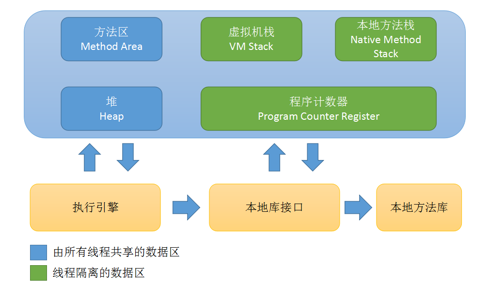
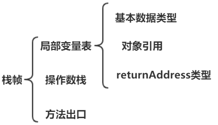
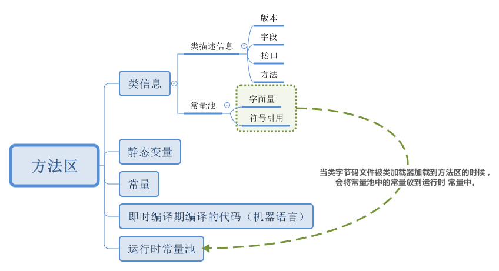
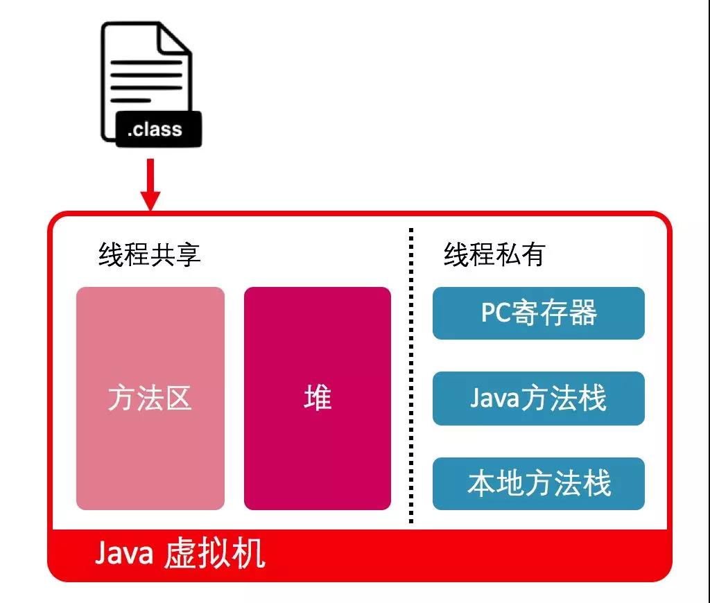
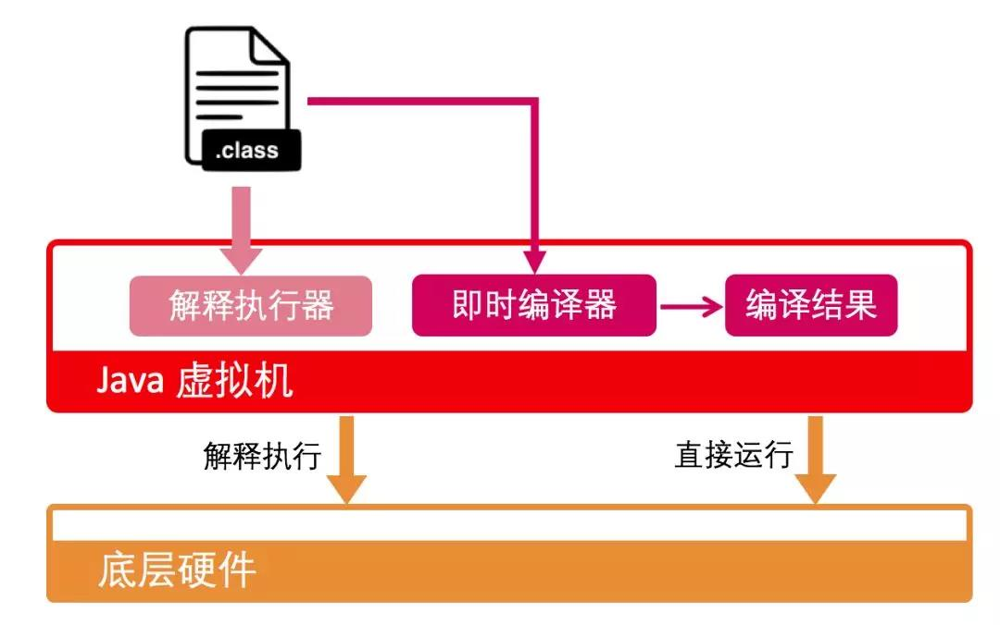

# 运行时数据区域

> 分析 Java 字节码是如何在虚拟机中运行的

##  1. 程序计数器（线程私有）

1.  每个线程都有自己的程序计数器，其生命周期与线程相同。

1.  程序计数器记录了当前线程执行字节码文件的行号。

1.  此区域是唯一一个在 JVM 规范中没有规定 OutOfMemoryError 情况的区域。

##  2. Java 虚拟机栈（线程私有）

1.  Java 虚拟机栈描述的是 **Java 方法执行的内存模型**。

1.  在 Java 方法执行的时候会创建一个栈帧（stack frame）。栈帧是方法执行时的基本数据结构。其结构如下：

    

1.  局部变量表分配的内存空间在编译期间就已经确定。

1.  此区域会可能会出现 StackOverflowError 和 OutOfMemoryError 异常。

##  3. 本地方法栈（线程私有）

作用与 Java 虚拟机栈非常相似，区别是本地方法栈区域是为 Native 方法服务，而 Java 虚拟机栈是为 Java 方法服务。

##  4. Heap（线程共享）

1.  堆是垃圾回收器主要管理的区域，所以堆也称为 GC 堆。

1.  堆中存放的是 **所有的对象实例** 和 **数组**。

1.  不需要连续的内存；可以选择固定大小；可以扩展。

1.  此区域可能会抛出 OutOfMemoryError 异常。

##  5. 方法区（线程共享）

1.  方法区用于储存已被虚拟机加载的类信息、常量、静态变量、即时编译器编译后的代码等数据。

1.  class 文件除了有版本、字段、方法、接口等描述信息外，还有常量池。

1.  常量池存放编译期生成的各种字面量和符号引用。

    1.  字面量就是我们所说的常量概念，如文本字符串、被声明为 final 的常量值等。

    1.  符号引用是一组符号来描述所引用的目标，符号可以是任何形式的字面量，只要使用时能无歧义地定位到目标即可。

1.  运行时常量池是方法区的一部分，所有线程共享。虚拟机加载 Class 后把常量池中的数据放入到运行时常量池。

1.  JDK7 版本中，字符串常量池已经被移到堆中。

1.  当常量池无法再申请到内存时会抛出 OutOfMemoryError 异常。

##  总结

> 以 HotSpot 虚拟机为例

上面我们了解了 JVM 运行时各数据区的作用。下面我们从两个方面来总结一下，Java 代码是如何在虚拟机中运行的。

-  ##   虚拟机视角：

    执行 Java 代码步骤：
    1.  将 Java 文件编译成字节码文件（.class）；
    1.  将字节码文件加载到 Java 虚拟机中的方法区；
    1.  Java 虚拟机是不能直接执行字节码文件，我们需要将其翻译成机器语言才行；
    1.  最后执行翻译后的机器语言。

在运行过程中，每当调用进入一个 Java 方法时，Java 虚拟机会在 Java 虚拟机栈中生成一个栈帧用于储存局部变量、操作数栈和方法出口等信息。这个栈的大小是在编译期间就已经确定的。

-  ##   硬件视角：

Java 字节码无法直接执行。因此，Java 虚拟机需要将字节码翻译成机器码。

在 HotSpot 里面，上述翻译过程有两种形式：第一种是解释执行，相当于同声传译，即每解析一条字节码，便翻译成机器码并执行；第二种是即时编译（Just-In-Time compilation，JIT），则相当于线下翻译，即将整个方法中所包含的字节码统一翻译成机器码后在执行。

前者的优势在于无需等待编译，而后者的优势在于实际运行速度更快。HotSpot 默认采用混合模式，综合了解释执行和即时编译两者的优点。它会先解释执行字节码，而后将其中反复执行的热点代码，以方法为单位进行即时编译。

## [BACK](../books/jvm.md)