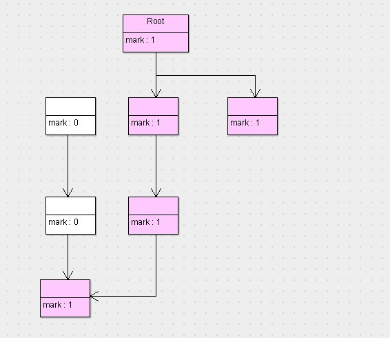
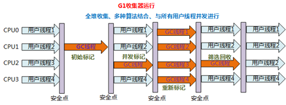

# 垃圾收集器

> 时间：2018-10-20

-   [1. 确认对象存活的算法](#chapter3-1)
-   [2. 引用的类型](#chapter3-2)
-   [3. 细说可达性分析中对象死亡](#chapter3-3)
-   [4. 垃圾收集算法](#chapter3-4)
-   [5. 了解 HotSopt 的算法实现](#chapter-5)
-   [6. 垃圾收集器](#chapter3-6)

---

> 本文主要介绍了 JVM 如何根据对象在 JVM 中生存的状态，来选用相应的垃圾收集算法和垃圾收集器将其回收。

## <a id="chapter3-1">1. 确认对象存活的算法</a>

JVM 垃圾收集的前提是已经知道哪些对象是可以被垃圾回收器所回收，哪些是不能被回收的。那么 JVM 必然有一个可行的方案来判断对象是否已经“死亡”。

下面有两个算法是各个 JVM 通常会选用的方案：

-   引用计数算法：

    给对象中添加一个 **引用计数器**，每当有一个地方引用它时，计数器值就加1；当引用失效时，计数器值就减1；任何时刻计数器为 0 的对象就是不可能再被使用，也就是意味着这个对象 “死亡”。

-   可达性分析算法：

     通过一系列的称为 “GC Roots” 的对象作为起始点，从这些节点开始向下搜索，搜索所走过的路径称为引用链（Refence Chain），当一个对象到GC Roots没有任何引用链相连时，则证明此对象不可用。

> HotSopt 中使用的是可达性分析算法。

## <a id="chapter3-2">2. 引用的类型</a>

什么！？引用还有类型！！在原来的理解中，一直认为只要对象与 “GC Roots” 之间有引用链相连就不会被垃圾收集器回收。事实上，有很多种引用在与 “GC Roots” 之间有引用链相连时也会被回收。

下面来介绍下 4 种引用类型：

1.  强引用（**Strong Reference**）
    
    使用 new 创建对象时，被创建的对象就是强引用。比如：Object obj = new Object()。只要强引用还存在，垃圾收集器永远不会回收掉被引用的对象。

1.  软引用（**Soft Reference**）

    描述一些还有用但并非必须的对象。软引用关联着的对象，在系统将要发生内存溢出异常之前，将会把这些对象列进回收范围之中，进行第二次回收。如果这次回收之后内存还是不足，才会抛出内存溢出异常。

1.  弱引用（**Weak Reference**）

    强度比软引用更弱一点。被弱引用关联的对象只能生存到下一次垃圾收集发生之前。也就是说，不管内存空间充足与否，都会将其回收。

1.  虚引用（**Phantom Reference**）

    最弱的一种引用关系。唯一目的：对象被收集器回收时，收到一个系统通知。

## <a id="chapter3-3">3. 细说可达性分析中对象死亡</a>

上面已经说到了引用类型，有些引用类型即使还存活还是有可能会被垃圾回收器所回收。

我们再往回看判断对象死亡的算法，在 HotSopt 中，使用的是可达性分析算法。那么，即使在可达性分析算法中 **不可达** 的对象也不一定是会被垃圾回收的。这是为什么呢？这就要来细说对象死亡了。

真正宣告一个对象死亡是要经历 2 个阶段：

> 注意：这里标记的是要被回收的对象。

1.  如果对象在进行可达性分析后没有与 GC Roots 有相连的引用链，那它将被第一次标记并进行筛选。

    筛选的条件：判断这个对象是否重写了 finalize() 方法或者 JVM 是否已经调用了对象的 finalize() 方法。

1.  如果对象类重写了 finalize() 方法并且 JVM 还没有调用过对象 finalize() 方法。那么，就会将对象放入 F-Queue 队列中。JVM 会通过一个 Finalizer 线程去遍历队列中的每个对象，并且执行它们的 finalize() 方法，稍后 GC 将会对 F-Queue 中的对象进行第二次标记，在第二次标记时对象将被回收。

## <a id="chapter3-4">4. 垃圾回收算法</a>

###   4.1 标记 - 清除算法

>   注意：标记的是要被回收的对象

算法分为两个阶段：

1.  标记阶段：标记要被回收的对象。

    

1.  清除阶段：清除被标记的对象。

    

优点：简单

缺点：

1.  效率问题。标记、清除这两个阶段的效率都不是非常的高。

1.  会产生空间碎片，在分配大对象的时候容易触发另一次的 Full GC。

适用于老年代。

### 4.2 复制算法

>   解决了标记清除效率的问题

将可用内存按容量划分为大小相等的两块，每次只使用其中的一块。当这块的内存用完了，就将还存活着的对象复制到另外一块内存上面，然后再把已使用过的内存空间一次清理掉。

-	优点：

    每次都是对整个半区进行内存回收，内存分配时也就不用考虑内存碎片等复杂情况。实现简单，运行高效。

-	缺点：

    1.  内存缩小为原来的一半。
    2.  在对象存活率较高时，就要进行较多的复制操作，效率将会变低。

### 4.3 标记 - 整理算法

标记过程与 “标记-清除” 算法一样，接着让所有存活的对象都向一端移动，然后直接清理掉端边界以外的内存。

-	优点：适用于老年代，内存空间利用率相比较复制算法要高。

### 4.4 分代收集算法

一般把 Java 堆分为新生代和老年代，这样就可以根据各个年代的特点采用最适当的收集算法。

-	新生代：适用复制算法
-	老年代：因为对象存活率高，适用于“标记-清理”或者“标记整理”算法进行回收。

## <a id="chapter3-5">5. 了解 HotSopt 的算法实现</a>

> 这节的知识，有助于理解下一节的垃圾收集器。

### 5.1 枚举 GC Roots

HotSopt 中使用的是可达性分析算法来判断对象是否存活。这里就涉及到枚举 GC Roots。

在这个分析过程中，对象引用关系不能发生变化，否则分析结果的准确性就无法保证。所以枚举 GC Roots 的时候需要暂停所有 Java 执行线程（Sun 将这件事情称为“Stop The World”）。

再暂停所有 Java 执行线程之后，JVM 通过一组 OopMaps 数据结构来快速定位 GC Roots，这样避免了 JVM 检查完所有执行上下文和全局的引用位置。

### 5.2 安全点

为什么会有安全点的出现呢？安全点与枚举 GC Roots 有什么关联？

上面提到了在枚举 GC Roots 过程中，是通过一组 OopMaps 数据结构来快速定位 GC Roots的。如果为每条指令都生成对应的 OopMaps，那将使 GC 成本变高。

所以，HotSopt 中会在安全点在枚举 GC Roots。

这样会带来两个问题：

1.	如何选择安全点？

    是否具有让程序长时间执行的特征。简单理解过来就是减少用户线程停顿的时间。

1.  如何在 GC 发生时让所有线程都“跑”到最近的安全点上再停顿下来？

    要想枚举 GC Roots，必须要让所有的线程在某一时间段内都暂停下来。下面有 2 种方式让其暂停下来：

    1.  抢先式中断（JVM 抢先）

        这个不需要线程的代码主动配合，在GC发生时，首先把所有线程中断，如果发现有线程中断的地方不在安全点上，就恢复线程，让它“跑”到安全点上。

    1.  主动式中断（用户线程主动）

        > HotSpot 使用的是这种方式

        当 GC 需要中断线程的时候，不直接对用户线程操作，仅仅是设置一个标志，各个线程执行时主动轮流访问这个标志，发现中断标志为真时就自己中断挂起。（轮流访问标志的地方和安全点是重合的）

了解安全点之后，其实安全点就是开始枚举 GC Roots 的地方。

### 5.3 安全区域

有了安全点之后，为什么还需要安全区域？

安全区域就是安全点的一个扩展。只要线程进入到安全区域，GC 就可以开始枚举 GC Roots 了。

是为了处理下面这种情况：

    线程处于 Sleep 状态或者 Blocked 状态，这个时候线程无法响应 JVM 的中断请求，“走” 到安全的地方中断挂起，JVM 显然不太可能等待线程重新分配 CPU 时间。

在上面这种情况下，无法响应的线程被标记为 Safe Region 状态，JVM 发起 GC 时，就不必管这种 Safe Region 状态的线程。当无法响应的线程恢复响应之后，需要检查系统是否已经完成了枚举 GC Roots。如果没有，继续等待；否则，继续执行。

## <a id="chapter3-6">6. 垃圾收集器</a>

有了前面那么多知识点的铺垫，我们终于要进入正题 - 垃圾收集器。

JDK 7 中 提供了下面 7 中垃圾收集器，下面我们一一来介绍它们的作用以及优缺点。

### 1.  Serial 收集器（新生代收集器）

特点：

1.	是一个单线程的收集器，所以只会使用一个 CPU 或者一条收集线程去完成垃圾收集工作。

2.	在进行垃圾收集时，必须暂停其他所有的工作线程，直到它收集结束(Stop the World)。

优点：简单高效。

应用场景：

1.	可用于收集内存不大（几十兆到一两百兆）的 **新生代**，可以在较短时间内完成收集，只要不频繁发生，都是可以接受的。

2.	对于运行在 **Client 模式** 下的虚拟机来说是一个很好的选择。

### 2.  ParNew 收集器（新生代收集器）

ParNew 收集器其实就是 Serial 收集器的多线程版本。除了使用多条线程进行垃圾收集之外，其余行为与 Serial 收集器完全一样。

特点：多线程进行 GC。

应用场景：适用于 **Server 模式** 下的虚拟机中首选的新生代收集器。

### 3.  Parallel Scavenge 收集器（新生代收集器）

> 吞吐量 = 运行用户代码时间 / (运行用户代码时间 + GC 所带来的停顿时间)

特点：保证一个可控制的吞吐量。

-   通过 `-XX:MaxGCPauseMillis` 参数控制最大 GC 所带来的停顿时间；

-   通过 `-XX:GCTimeRatio` 参数设置垃圾回收时间占程序运行时间的百分比，这个参数应该大于 0 且小于 100。其公式为 1/(1+n)。

应用场景：

-	以高吞吐量为目标，即减少垃圾收集时间，让用户代码获得更长的运行时间，主要适合在后台运算而不需要有太多交互的任务。

-  	适用于批量处理、工资支付，订单处理。

### 4.  Serial Old 收集器（老年代收集器）

特点：  
-	单线程、老年代收集器

-	使用“标记-整理”算法

-	主要给 Client 模式下的虚拟机使用

-	如果在 Server 模式下使用，主要出于下面两个目的：

    1. 在 JDK 1.5 之前，与 Parallel Scavenge 收集器搭配使用。

    2. 作为 CMS 收集器的后备预案，在并发收集发生 Concurrent Mode Failure 时使用。

### 5.  Parallel Old 收集器（老年代收集器）

是 Parallel Scavenge 收集器的老年代版本。

特点：

1.	多线程、老年收集器

2.	使用“标记-整理”算法

3.	JDK 1.6 中开始提供

应用场景：

在注重吞吐量以及 CPU 资源敏感的场合，都可以优先考虑 Parallel Scanvenge + Parallel Old 收集器。

### 6.  CMS 收集器（老年代收集器）

CMS（Concurrent Mark Sweep）收集器是一种以获取最短回收停顿时间为目标的收集器。

特点：

1.	采用“标记-清除”算法

2.	老年代收集器

CMS 收集垃圾经历 4 个步骤：

>   这里标记的是 **存活的对象**。

1.  初始标记

    -   会 Stop The World；
    -   标记一下 GC Roots 能够直接关联到的对象。

1.  并发标记

    -   用户程序与 GC Tracing 并发执行。

1.  重新标记

    -   会 Stop The World；
    -   修正因用户程序执行而导致标记发生变动的那一部分标记。

1.  并发清除

    -   用户程序和 GC 并发执行。

优点：并发收集、低停顿。

缺点：

1.  CMS 收集器对 CPU 资源非常敏感

    在 CMS 收集器中，GC 线程的数量是与 CPU 的数量相关。
    
    GC 线程数 = (CPU 个数 + 3) / 4；

    当 CPU 个数小于 2 时，CMS 收集器对用户程序的影响可能就会变得很大。

1.  CMS 收集器无法处理浮动垃圾。

    什么是浮动垃圾？

    CMS 在执行并发清除的时候，用户线程所产生的垃圾是不会被当前这次 GC 所处理,只好留到下一次 GC 再处理它们。这部分的垃圾就称为浮动垃圾。

    也是由于用户程序需要继续执行，所以 CMS 收集器不能像其他收集器那样等待老年代几乎都要被占满了再进行垃圾收集，而是要预留一部分内存空间供并发收集的用户程序使用。

    如果在并发收集时，用户程序找不到可分配的内存空间的时候就会导致 “Concurrent Mode Faliure”，JVM 就会启动备选方法 - Serial Old 去回收垃圾。

1.  会产生大量的空间碎片。因为 CMS 使用的是 “标记 - 清除” 算法。

    不过可以通过 `-XX:+UseCMSCompactAtFullCollection` 开关参数，在 CMS 顶不住要进行 Full GC 时进行内存的合并整理。这个时候是必须 Stop The World。

### 7.  G1（Garbage-First）收集器

G1 收集器是面向服务端应用的垃圾收集器。

G1 与 CMS 一样都是专注于减少收集所带来的停顿时间。

G1 收集垃圾的步骤：

> 与 CMS 一样，标记的都是存活的对象。

1.  初始标记（Stop The World）

    快速标记出与 GC Roots 直接相连的对象，并且修改 TAMS（Next Top at Mark Start）的值，让下一阶段用户程序并发运行时，能在正确可用的 Region 中创建对象。

1.  并发标记

    从 GC Root 开始对堆中的对象进行 **可达性分析**，找出 **存活的对象**，这个阶段耗时比较长。

1.  最终标记（Stop The World）

    修正在 **并发标记** 阶段因用户程序继续运作而导致标记产生变化的那一部分标记。

1.  筛选回收

    -   首先，对各个 Region 的回收价值和成本进行排序；

    -   接着，根据用户所期望的 GC 停顿时间来制定回收计划。

特点：

-   并行与并发

    G1 能够充分的利用多 CPU 或 多核环境下的硬件优势，来减少收集垃圾所带来的时间（Stop The World）；

    支持并发收集。

-   分代收集

    分代的概念在 G1 中还是保留的。G1 不需要其他的垃圾收集器来配合收集，因为 G1 是针对于整个 Java 堆来进行管理的，但 G1 能够采用不同的方式去处理新创建的对象（新生代的对象）、已经存活一段时间的对象（老年代的对象）和熬过多次 GC 的对象（永久代的对象）。

-   空间整理

    与 CMS 收集器采用的 “标记 - 清除” 算法不同。从整体上来看，G1 采用的是 “标记 - 整理” 算法；从局部上来看（两个 Region 之间），G1 采用的是 “复制算法”。无论是上面那种收集算法，G1 都能保证在垃圾收集之后，不会产生空间碎片。

-   可预测的收集时间

    G1 除了能够减少暂停时间之外，还能建立可预测的停顿时间时间模型，能让使用者明确指定在一个长度为 M 毫秒的时间片段内，消耗在垃圾收集上的时间不超过 N 毫秒。

## [BACK](../books/jvm.md)