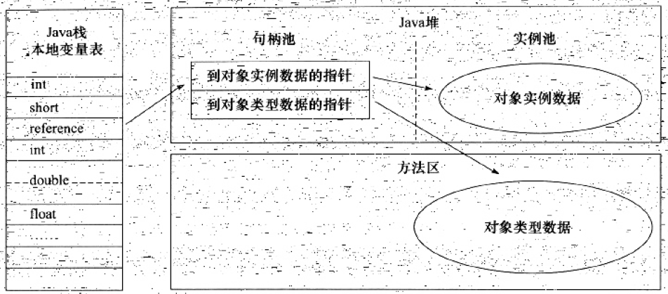

#   探秘 Hotspot 虚拟机中的对象

> 上一节介绍了 Java 虚拟机运行时的数据分配区域，下面这节将对堆中的 Java 实例进行分析。

1.  [对象的创建](#5-1)
1.  [对象的内存布局](#5-2)
1.  [对象的访问定位](#5-3)

---

##  <a id="5-1">1.  对象的创建</a>

当 JVM 遇上一条 new 指令时，将会去检查这条指令的参数是否能在常量池中定位到一个类的符号引用，并且去检查这个符号引用代表的类是否已经被加载、链接和初始化过。如果没有，那么必须先执行相应的类加载过程（有兴趣的可以先跳过这章，在 [虚拟机类加载机制](../books/jvm-4.md) 中将会详细介绍）。

在类加载检查通过之后，JVM 将会为新生对象分配内存空间，根据堆内存的分布 **是否规整** 可以分为两种方式：

1.  如果堆内存分布规整，那么使用 “指针碰撞” 的方式来分配内存。

    所谓的 “指针碰撞” 就是将所有用过的内存都放到一边，空闲的内存放在另一边，中间放着一个指针作为分界点的指示器，那所分配内存就仅仅是把那个指针向空闲空间那边挪动一段与对象大小相等的距离。

1.  如果堆内存分布不规整，那么使用 “空闲列表” 的方式来分配内存。

    所谓的 “空闲列表” 就是在 JVM 中维护着一个列表。这个列表中记录着那些内存块是可用的，那些是不可用的。在给新生对象分配内存的时候，JVM 会从这个列表中找到一块足够大的空间划分给对象实例，并且更新列表上的记录。

在解决了新生对象分配内存的问题之后，还需要解决一个问题：在并发情况下，如何保证正确地分配内存？

> 在并发情况下，为对象分配内存并不是线程安全的，可能会出现正在给对象 A 分配内存，指针还没来得及修改，对象 B 又同时使用了原来的指针来分配内存的情况。

为了避免上面的情况发生，有 2 中方案可以解决这个问题：

1.  对分配内存空间的动作进行同步处理 —— 实际上 JVM 采用 CAS + 失败重试的方式保证更新操作的原子性。

1.  把内存分配的动作按照线程划分在不同的空间之中进行，即每个线程在 Java 堆中预先分配一小块内存，成为本地线程分配缓冲（Thread Local Allocation Buffer）。当线程需要分配内存的时候，会优先使用 TLAB，当其使用完了，才会同步锁定。

## <a id="5-2">2.   对象的内存布局</a>

在 JVM 为新生对象分配好内存之后，将会为其做一些必要的设置。而这些设置都存储在对象头中。

下面我们来看看对象在内存中存储的布局，它可以分为 3 块区域：

> Mark Word 这块知识点有利于理解 synchronized 的四种锁状态，详细请看这篇文章 —— [volatile 与 synchronized 锁的四种状态](../books/concurrency-1.md)

1.  对象头，包括两部分：Mark Word 和类型指针

    -   Mark Word 中储存着对象自身的运行时数据：哈希码（HashCode）、GC 分代年龄、锁状态标志、线程持有的锁、偏向线程 ID、偏向时间戳等。

    -   类型指针，对象指向它的类元数据的指针，虚拟机通过这个指针来确定这个对象是哪个类的实例。这个指针是指向方法区对象类型数据的指针。

    -   如果对象是数组，还有一部分于存储数组长度。

    

1.  实例数据

    这块区域的是对象真正存储的有效信息，也是在程序代码中所定义的各种类型的字段内容（基本数据类型）。

1.  对齐填充

    这块区域不是必然存在的，也没有特别的含义，它仅仅起着占位符的作用。由于对象的大小必须为 8 字节的整数倍，并且对象头部分正好是 8 字节的整数倍，因此，当对象实例数据部分没有对齐时，就需要通过对齐填充来补全。

## <a id="5-3">3.   对象的访问定位</a>

对象创建出来之后我们该如何去访问堆中的对象呢？实际上，我们是通过栈上的对象引用来定位堆中的对象。不同的虚拟机有不同的定位方案，市面上有 2 种主流的定位方案：

1.  句柄访问

    JVM 会在堆中划分出一块内存作为句柄池，reference 中存储的就是对象的句柄地址，而句柄中包含了对象实例数据与类型数据各自的具体地址信息。

    

    优点：reference 中存储的是稳定的句柄地址，在对象被移动（比如GC）时只会改变句柄中的实例数据指针，而 reference 本身不需要修改。

1.  直接指针

    优点：访问速度快，中间不需要经过句柄池，节省了一次指针定位的时间开销。

    

## [BACK](../books/jvm.md)