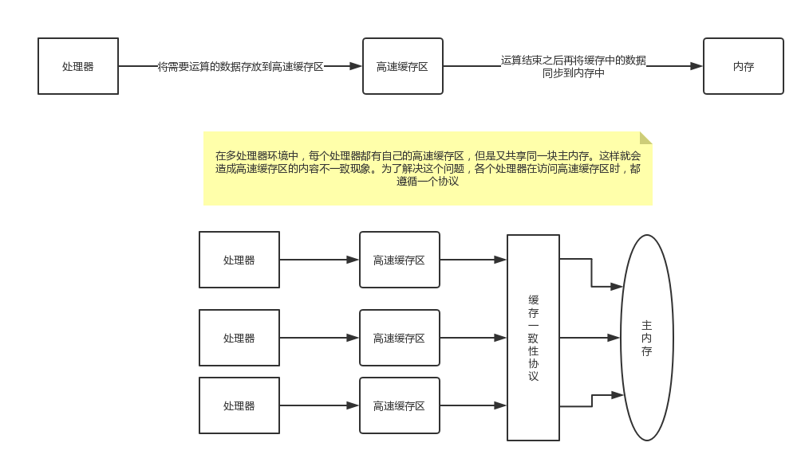
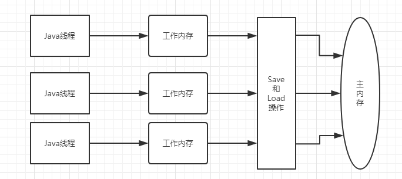
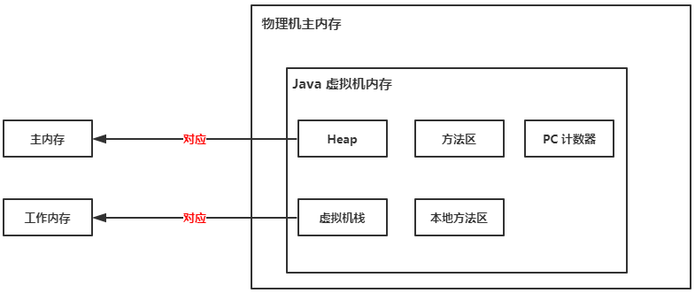

# Java 内存模型

1.  [物理机内存访问](#1-1)
1.  [Java 内存模型](#1-2)
    1.  [Java 内存模型结构](#1-2-1)
    1.  [内存间交互操作](#1-2-2)

---

## <a id="1-1">1.   物理机内存访问</a>

处理器至少要与内存交互，如读取运算数据、存储运算结果等，这个 I/O 操作是很难消除的。由于计算机的存储设备与处理器的运算速度有几个数量级的差距，所以现代计算机系统不得不都加入一层读写速度与处理器运算速度接近的高速缓存区来作为内存与处理器之间的缓存。

在内存和处理器之间加入高速缓存之后，将会带来一个问题：缓存不一致性问题。

### 1.1 缓存不一致问题

在多处理器系统中，每个处理器都有一个自己的高速缓存，但是它们又共享同一块主内存。那么，当多个处理器的运算任务都涉及同一块主内存区域块时，将可能导致各自的缓存数据不一致。

### 1.2 解决缓存不一致问题

为了解决缓存不一致所带来的问题，各个处理器访问缓存时都遵循一些协议，在读写时要根据协议来进行操作，这类协议有 MSI、MESI、MOSI、Synapse、Firefly 以及 Dragon Protocol 等。

## <a id="1-2">2.   Java 内存模型</a>

Java 虚拟机视图通过定义一种 Java 内存模型来 **屏蔽** 掉各种硬件和操作系统的内存访问差异，以实现让 Java 程序在各个平台下都能达到一致的内存访问效果。

### <a id="1-2-1">2.1 Java 内存模型结构</a>

Java 内存模型的主要目标是定义程序中各个变量的访问规则，即在虚拟机中将变量存储到主内存和从主内存中取出变量这样的底层细节。

上面提到的 **主内存** 和下面即将要提到的 **工作内存** 是 Java 内存模型中最重要的两块区域。

#### 2.1.1 如何理解主内存和工作内存？

-   主内存：可以类比上面物理机的主内存，但是这里只是 Java 虚拟机内存的一部分。

-   工作内存：每条线程都有一个属于自己的工作内存（可以类比上面物理机的高速缓存）。线程对变量的所有操作（赋值，读取等）都必须在工作内存中进行，不能直接读写主内存中的变量。

这个主内存和工作内存与 [运行时数据区域](../books/jvm-1.md) 这篇所讲述的 Java 内存区域中的 Java 堆、栈、方法区并不是同一个层次的划分，这两者基本上是没有关系的，如果两者一定要勉强对应起来，就如下图所示：

### <a id="1-2-2">2.2 内存间交互操作</a>

Java 虚拟机定义了 8 种原子操作，来完成一个变量如何从主内存拷贝到工作内存、如何从工作内存同步回主内存之类的实现细节，即实现了主内存和工作内存之间的交互协议。

下面来看看这 8 种操作：

1.  lock

    作用于 **主内存中的变量**，它把一个变量标识为一条线程独占的状态。其他线程只有等到当前线程执行了 unlock 操作之后才可能获取到这个变量。

1.  unlock

    作用于 **主内存中的变量**，它把一个处于锁定状态的变量释放出来，释放后的变量才可以被其他线程锁定。

1.  read

    作用于 **主内存中的变量**，它把一个变量的值从主内存中传输到线程的工作内存中，以便随后的 load 动作使用。

1.  load

    作用于 **工作内存中的变量**，它把 read 操作从主内存中得到的变量值载入工作内存中的变量副本中。

1.  use

    作用于 **工作内存中的变量**，它把工作内存中一个变量的值传递给执行引擎，每当虚拟机遇到一个需要 **使用到变量的值的字节码指令** 将会执行这个操作。

1.  assign

    作用于 **工作内存中的变量**，它把执行引擎接收到的值 **赋值** 给工作内存中一个变量，每当虚拟机遇到一个给 **变量赋值的字节码指令** 将会执行这个操作。

1.  store

    作用于 **工作内存中的变量**，它把一个变量的值从线程的工作内存中传输到主内存，以便随后的 write 操作使用。

1.  write

    作用于 **主内存中的变量**，它把 store 操作从工作内存得到的变量值同步回主内存的变量中。

除此之外，Java 内存模型还规定了在执行上述 8 种基本操作时 **必须满足** 如下规则：

1.  read 和 load、store 和 write 这两对操作必须同时出现，即不允许一个变量从主内存读取了但工作内存不接受，或者从工作内存中将变量传输到主内存，但是主内存不接受的情况出现。

1.  不允许一个线程丢弃它的最近的 assign 操作，即变量在工作内存中改变了之后必须把这个变化同步回主内存。