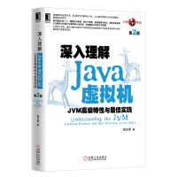
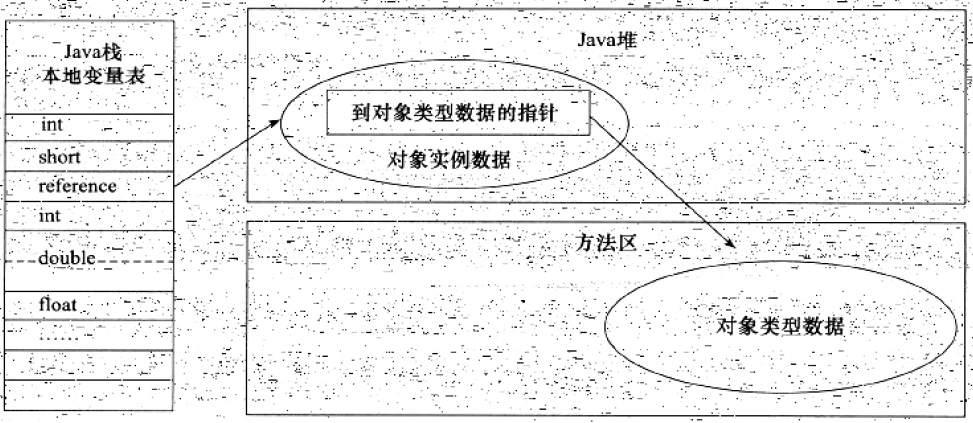
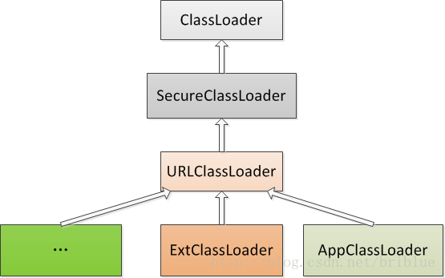

# Book

## 目录

- [Java内存区域与内存溢出异常](#OOM)
    - [运行时数据区域](../books/jvm-1.md)
    - [HotSpot虚拟机对象](#HOTSPOT-OBJ)
    - [总结](#OOM-SUMMARY)
- 垃圾收集器与内存分配策略
    - [垃圾收集器](../books/jvm-2.md)
    - [内存分配与回收策略](../books/jvm-3.md)
- [类文件结构](#CLASS-FILE-STRUCTURE)
- 虚拟机类加载机制
    - [类加载的过程](../books/jvm-4.md)
    - [类加载器](#CLASSLOADER-MECHINE)
- [Java内存模型与线程](#MEMORY-MODEL-AND_THREAD)
    - [物理机的内存模型](#PHYSIC-MEMORY-MODEL)
    - [Java内存模型](#JAVA-MEMORY-MODEL)
    - [Java与线程](#JAVA-AND-THREAD)
- [线程安全和锁优化](#THREAD-SECURITY-AND-LOCK-OPTIMIZE)

# <a id="HOTSPOT-OBJ">HotSpot虚拟机对象</a>

### 创建对象（new指令）
- 检查这个指令的参数是否能在常量池中定位到一个类的符号引用。
- 检查这个符号引用代表的类是否已被加载、解析和初始化过。如果没有，必须先执行相应的类加载过程。
- 类加载检查通过之后（其实对象所需的内存大小已经完全确定），JVM将为新生对象分配内存，此时一块确定大小的内存从Java堆中划分出来。
- Java堆的划分方式：选择哪种分配方式由**Java堆是否规整决定**
    - 指针碰撞(Bump the Pointer),假设Java堆中内存是**绝对规整**的，所有用过的内存都放在一边，空闲的内存放在另一边，中间放着一个指针作为分界点的指示器。
    - 空闲列表(Free List),假设Java堆中的内存并**不是规整**的，虚拟机就必须维护一个列表，记录上哪些内存块是可用的，在分配的时候从列表中找到一块足够大的空间划分给对象实例，并更新列表上的记录。

> 对象在内存中储存的布局可以分为3块区域：对象头（Header）、实例数据（Instance Data）、对齐填充（Padding）。

### 对象的内存布局
- HotSpot虚拟机的**对象头**包括2部分：
    - 第一部分，用于储存对象自身的运行时数据，哈希码（HashCode）、GC分代年龄、锁状态标志、线程持有的锁、偏向线程ID等。
    - 第二部分是类型指针，即对象指向它的类元数据的指针。虚拟机通过这个指针来确定这个对象是哪个类的实例。
    - 如果对象是一个Java数组，对象头中还有一块用于记录数组的长度的数据，因为虚拟机可以通过普通Java对象的元数据信息确定Java对象的大小，但是从数组的元数据中却无法确定数组的大小。

- **实例数据**，是对象真正储存的有效信息，也是在程序代码中所定义的各种类型的字段内容。

- **对齐填充**，并不是必然存在的，也没有特别的含义，它仅仅起着占位符的作用。对于HotSpot VM要求对象的大小必须是8字节的整数倍。当对象实例数据部分没有对齐时，就需要通过对齐填充来不全。

### 对象的访问定位
- 主流的访问方式：句柄、直接指针。
    - **句柄**，Java堆中将会划分出一块内存作为句柄池，reference中储存的就是对象的句柄地址，而句柄中包含了类信息。
    
    - **直接指针**
    
- 句柄与直接指针的优缺点:
    - 句柄：reference中储存的是稳定的句柄地址，在对象被移动时只会改变句柄中的实例数据指针，而reference本身不需要修改。
    - 直接指针：速度更快，它节省了一次指针定位的时间开销，由于对象的访问在Java中非常频繁，因此这类开销积少成多也是一项非常可观的执行成本(HotSport是使用直接指针进行对象访问的)。

- HotSpot虚拟机中不区分虚拟机栈和本地方法栈。

# <a id="OOM-SUMMARY">总结</a>
- 程序计数器、虚拟机栈、本地方法栈3个区域随线程而生、随线程而灭。
- 栈中的每一个栈帧中分配的多少内存基本上是在类结构确定下来时就已知的。因此这几个区域的内存分配和回收都具备确定性，就不需要过多考虑回收的问题。

# <a id="CLASS-FILE-STRUCTURE">类文件结构</a>

-	Class文件是一组以8位字节为基础单位的二进制流，各个数据项目严格按照顺序紧凑地排列在Class文件之中。
-	Class文件格式采用一种类似C语言结构体的伪结构来储存数据。
-	Class文件结构只有两种数据类型：无符号数、表。
-	无符号数：属于基本的数据类型，可以用来描述数字、索引引用、数量值或者按照UTF-8编码构成字符串值。

表：由多个无符号数和其他表作为数据项构成。

##	魔数
每个Class文件的头4个字节称为魔数，魔数唯一的作用就是确定这个文件是否为一个能被虚拟机接受的Class文件。

第5，6字节是次版本号（Minor Version），第7，8字节是主板本号（Major Version）。

##	常量池
紧接着主板本号之后的是常量池。

常量池中主要存放两大类常量：字面量和符号引用。

字面量包括：文本字符串、声明为final的常量值。
符号引用包括：
-   类和接口的全限定名。
-   字段的名称和描述符
-   方法的名称和描述符

##	访问标志
常量池之后，紧接着是访问标志。

访问标志用于识别一些类或者接口层次的访问信息，包括：这个class是类还是接口；是否定义为public类型；是否定义为abstract类型；如果是类的话，是否被声明为final等。

##	类索引、父类索引与接口索引集合
Class文件中由这三项数据来确定这个类的继承关系。

##	字段表集合
字段表用于描述接口或者类中声明的变量。

字段包括类级变量和实例级变量，不包括方法内部的局部变量。

# <a id="CLASSLOADER-MECHINE">类加载器</a>

### 概念

加载阶段中的“通过一个类的全限定名来获取描述此类的二进制字节流”这个动作放到Java虚拟机外部实现，以便让应用程序自己决定如何去获取所需要的类。实现这个动作的代码块就是“类加载器”。

###	类与类加载器
比较两个类是否相等，还需要判断这两个类是否由同一个ClassLoader加载进来的。

###	双亲委派模型
1.	从Java虚拟机角度来看，只存在2中类加载器：
    -	启动类加载器（Bootstrap ClassLoader），在HotSpot中这个加载器是C++实现的。
    -  	其他类加载器，由Java语言实现的，独立于JVM外部，并且全都继承自抽象类java.lang.ClassLoader.

2.	从开发人员角度来看，存在3种类加载器：
    -	Bootstrap ClassLoader（启动类加载器）
    -	Extension ClassLoader（扩展类加载器）
    -	Application ClassLoader（应用程序类加载器）

###	双亲委派模式的工作过程

 
如果一个类加载器收到了类加载的请求，它首先不会自己去尝试加载这个类，而是把这个请求委派给父类加载器去完成，每一个层次的类加载器都是如此。因此所有的加载请求最终都应该委派到顶层的启动类加载器中，只有当父加载器反馈自己无法完成这个加载请求时，子加载器才会尝试自己加载。
 
###	双亲委派模型的代码实现

实现双亲委派的代码都集中在java.lang.ClassLoader的loadClass()方法中。

 
双亲委派模型的好处：
1.	每个类都只会被加载一次，避免了重复加载，这样也不会出现
2.	有效的避免了某些恶意类的加载（比如自定义的java.lang.Object类）。

### 双亲委派模式在什么情况下会被打破？

ContextClassLoader：有些时候ClassLoader的双亲委托机制不能完成一些特定的类加载任务，比如java提供一些SPI，由厂商来进行具体的实现，比如jdbc，各个数据库厂商根据java提供的SPI来实现各自数据库的连接；这些SPI都定义在核心类里，由bootstrap ClassLoader加载，而在SPI 接口中的代码经常需要加载具体的实现类，但厂商的具体实现又不能由Bootstrap ClassLoader加载，这个时候就需要ContextClassLoader。

##  [BACK](../../mds/summary.md)