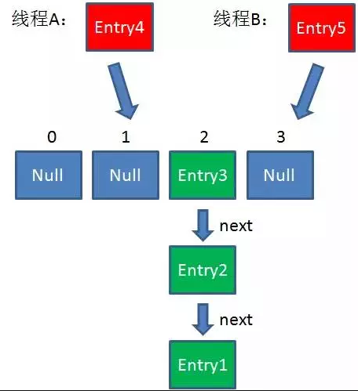
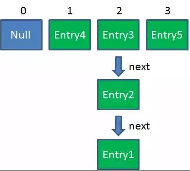
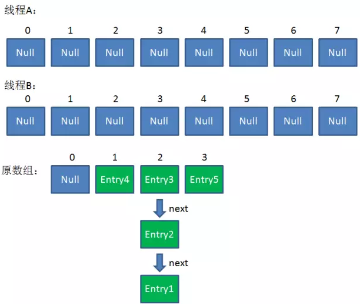
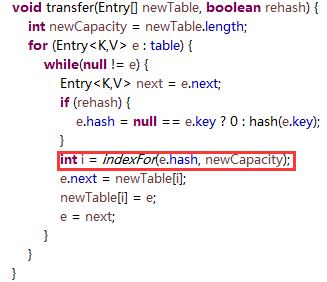
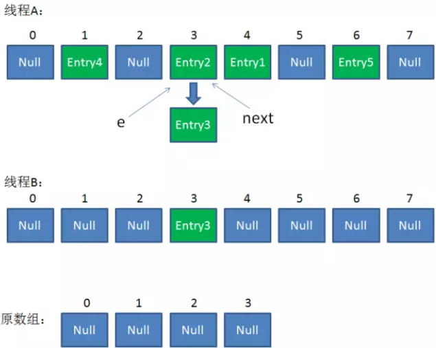
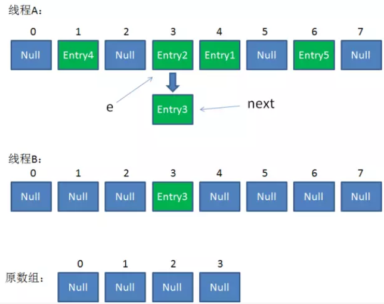
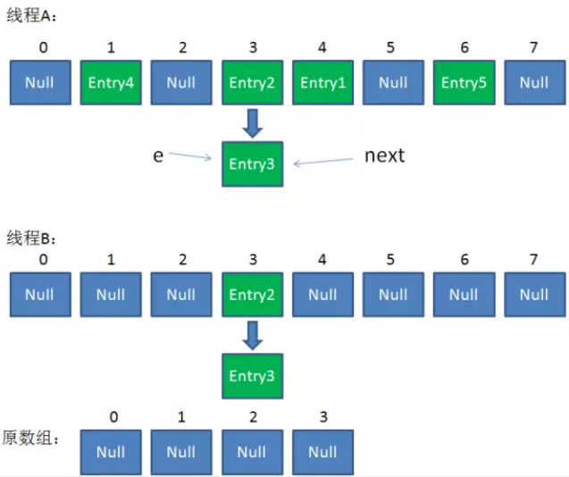
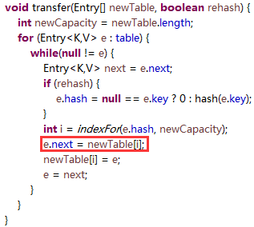
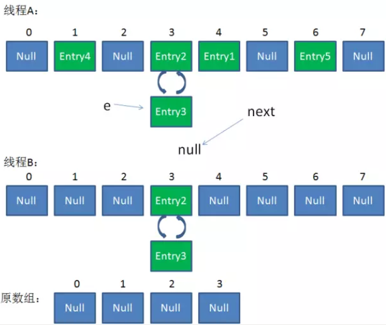

# HashMap

-   [JDK1.7](#jdk7)
    -   [HashMap初始化](#init-jdk7)
    -   [put详解](#put-jdk7)
        -   [计算key对应的下标](#key-index-jdk7)
        -   [添加节点到链表中](#add-entry-jdk7)
        -   [扩容](#rehash-jdk7)
    -   [get](#get-jdk7)
    -   [为什么说HashMap是非线程安全？](#not-security-jdk7)
    -   [JDK7 HashMap总结](#summary-jdk7)
-   [JDK1.8](#jdk8)
    -   [put详解](#put-jdk8)
        -   [扩容](#rehash-jdk8)    
    -   [get过程分析](#get-jdk8)
    -   [JDK8 HashMap总结](#summary-jdk8)

## <a id="jdk7">JDK1.7</a>

### 结构


-   HashMap 里面是一个数组，然后数组中每个元素是一个单向链表。
-   每个绿色的实体是嵌套类 Entry 的实例，Entry 包含四个属性：key, value, hash 值和用于单向链表的 next。

### <a id="init-jdk7">HashMap 初始化</a>

```java
//初始容量为2的倍数，这里是16
static final int DEFAULT_INITIAL_CAPACITY = 1 << 4;

static final float DEFAULT_LOAD_FACTOR = 0.75f;

public HashMap() {
    this(DEFAULT_INITIAL_CAPACITY, DEFAULT_LOAD_FACTOR);
}

public HashMap(int initialCapacity, float loadFactor) {
    if (initialCapacity < 0)
        throw new IllegalArgumentException("Illegal initial capacity: " +
                                            initialCapacity);
    if (initialCapacity > MAXIMUM_CAPACITY)
        initialCapacity = MAXIMUM_CAPACITY;
    if (loadFactor <= 0 || Float.isNaN(loadFactor))
        throw new IllegalArgumentException("Illegal load factor: " +
                                            loadFactor);

    //初始化负载因子
    this.loadFactor = loadFactor;
    //初始化扩容阈值
    threshold = initialCapacity;
    init();
}
```

### <a id="put-jdk7">put详解</a>

上面只是对负载因子和阈值的初始化，对Map的初始化是在 **put(K, V)** 里面进行的。

```java
public V put(K key, V value) {
    if (table == EMPTY_TABLE) {
        inflateTable(threshold);
    }
    // 如果key为null，将其放入table[0]中
    if (key == null)
        return putForNullKey(value);
    //对键值进行散列
    int hash = hash(key);
    //根据散列值和数组的长度来计算当前Key对应的数组下标
    int i = indexFor(hash, table.length);
    for (Entry<K,V> e = table[i]; e != null; e = e.next) {
        Object k;
        if (e.hash == hash && ((k = e.key) == key || key.equals(k))) {
            V oldValue = e.value;
            e.value = value;
            e.recordAccess(this);
            return oldValue;
        }
    }

    modCount++;
    addEntry(hash, key, value, i);
    return null;
}
```

在第一个元素插入 HashMap 的时候做一次数组的初始化，就是先确定初始的数组大小，并计算数组扩容的阈值。

```java
 private void inflateTable(int toSize) {
    //将容量设置为2的N次方
    int capacity = roundUpToPowerOf2(toSize);
    //计算扩容阈值
    threshold = (int) Math.min(capacity * loadFactor, MAXIMUM_CAPACITY + 1);
    table = new Entry[capacity];
    initHashSeedAsNeeded(capacity);
}
```

### <a id="key-index-jdk7">计算Key对应的下标</a> 

```java
static int indexFor(int h, int length) {
    // assert Integer.bitCount(length) == 1 : "length must be a non-zero power of 2";
    return h & (length-1);
}
```

这个方法很简单，简单说就是取 hash 值的低 n 位。这里就是利用了数组的容量都是2的N次方倍的好处。如在数组长度为 32 的时候，其实取的就是 key 的 hash 值的低 5 位，作为它在数组中的下标位置。

### <a id="add-entry-jdk7">添加节点到链表中</a>

```java
void addEntry(int hash, K key, V value, int bucketIndex) {
    //如果当前HashMap的大小 >= 阈值，并且当前Key对应的数组下标不为null，就进行扩容。
    if ((size >= threshold) && (null != table[bucketIndex])) {
        //将table的容量扩大为原来的2倍，再将原来的节点重新计算下标放入新的table内
        resize(2 * table.length);
        //计算当前key的hash
        hash = (null != key) ? hash(key) : 0;
        //计算key对应的数组下标
        bucketIndex = indexFor(hash, table.length);
    }
    //创建节点
    createEntry(hash, key, value, bucketIndex);
}

//将新值放到表头，然后size++
void createEntry(int hash, K key, V value, int bucketIndex) {
    Entry<K,V> e = table[bucketIndex];
    table[bucketIndex] = new Entry<>(hash, key, value, e);
    size++;
}
```

### <a id="rehash-jdk7">扩容</a>

```java
void resize(int newCapacity) {
    Entry[] oldTable = table;
    int oldCapacity = oldTable.length;
    if (oldCapacity == MAXIMUM_CAPACITY) {
        threshold = Integer.MAX_VALUE;
        return;
    }
    //初始化新table
    Entry[] newTable = new Entry[newCapacity];
    //将原来旧table中的节点迁移到新的数组里面
    transfer(newTable, initHashSeedAsNeeded(newCapacity));
    //刷新table
    table = newTable;
    //重新计算扩容阈值
    threshold = (int)Math.min(newCapacity * loadFactor, MAXIMUM_CAPACITY + 1);
}

// transfer这个方法其实很简单
// 就是遍历了old table中每个下标里面的链表，将里面的元素取出来，根据 new table的容量重新计算下标
// 最后放入新的table中
void transfer(Entry[] newTable, boolean rehash) {
    int newCapacity = newTable.length;
    for (Entry<K,V> e : table) {
        while(null != e) {
            Entry<K,V> next = e.next;
            if (rehash) {
                e.hash = null == e.key ? 0 : hash(e.key);
            }
            int i = indexFor(e.hash, newCapacity);
            e.next = newTable[i];
            newTable[i] = e;
            e = next;
        }
    }
}
```

### <a id="get-jdk7">获取节点</a>

```java
public V get(Object key) {
    if (key == null)
        return getForNullKey();
    
    // 根据key获取相应的节点
    Entry<K,V> entry = getEntry(key);

    return null == entry ? null : entry.getValue();
}


final Entry<K,V> getEntry(Object key) {
    if (size == 0) {
        return null;
    }

    // 计算key的哈希码
    int hash = (key == null) ? 0 : hash(key);

    // 下面这个循环就是为了获取key对应的节点的
    for (Entry<K,V> e = table[indexFor(hash, table.length)];
            e != null;
            e = e.next) {
        Object k;
        if (e.hash == hash &&
            ((k = e.key) == key || (key != null && key.equals(k))))
            return e;
    }
    return null;
}

// 如果key为null
private V getForNullKey() {
    // 先判断一下map是否添加过节点，
    if (size == 0) {
        // 没有添加过就返回null
        return null;
    }

    // 遍历table[0]中的所有节点，查找key为null的节点，并返回
    for (Entry<K,V> e = table[0]; e != null; e = e.next) {
        if (e.key == null)
            return e.value;
    }
    return null;
}
```

## <a id="not-security-jdk7">为什么说HashMap是非线程安全？</a>

在并发环境下，HashMap在扩容的时候可能会出现**回环链表**，这时候对HashMap进行get操作会出现 CPU 资源占用100%的情况。

下面来模拟一下环境。

假设一个HashMap已经到了Resize的临界点。此时有两个线程A和B，在同一时刻对HashMap进行Put操作：



put完之后



此时达到Resize条件，两个线程各自进行Rezie的第一步，也就是扩容：



这时候，两个线程都走到了ReHash的步骤。让我们回顾一下ReHash的代码：


假如此时线程B遍历到Entry3对象，刚执行完红框里的这行代码，线程就被挂起。对于线程B来说：

> e = Entry3    
> next = Entry2

这时候线程A畅通无阻地进行着Rehash，当ReHash完成后，结果如下（图中的e和next，代表线程B的两个引用）：


直到这一步，看起来没什么毛病。接下来线程B恢复，继续执行属于它自己的ReHash。线程B刚才的状态是：

>e = Entry3     
>next = Entry2



当执行到上面这一行时，显然 i = 3，因为刚才线程A对于Entry3的hash结果也是3。


我们继续执行到这两行，Entry3放入了线程B的数组下标为3的位置，并且e指向了Entry2。此时e和next的指向如下：

> e = Entry2    
> next = Entry2

整体情况如图所示：



接着是新一轮循环，又执行到红框内的代码行：


> e = Entry2    
> next = Entry3

整体情况如图所示：



接下来执行下面的三行，用头插法把Entry2插入到了线程B的数组的头结点：


整体情况如图所示：



第三次循环开始，又执行到红框的代码：


> e = Entry3    
> next = Entry3.next = null

最后一步，当我们执行下面这一行的时候，见证奇迹的时刻来临了：



> newTable[i] = Entry2      
> e = Entry3    
> Entry2.next = Entry3      
> Entry3.next = Entry2  

链表出现了环形！

整体情况如图所示：



此时，问题还没有直接产生。当调用Get查找一个不存在的Key，而这个Key的Hash结果恰好等于3的时候，由于位置3带有环形链表，所以程序将会进入死循环！

## <a id="summary-jdk7">JDK7 HashMap总结</a>

-   HashMap是非线程安全的。
-   HashMap初始化数组是在第一次put的时候进行的。
-   HashMap每次扩容的时候，新的容器容量为旧的容器的 **2** 倍。
-   对于key为null的键值对来说，是存放在table[0]中的。
-   新添加的节点位于链表的表头。

## <a id="jdk8">JDK1.8</a>

Java8对HashMap进行了一些修改，最大的不同就是利用了红黑树，所以HashMap在Java8中的数据结构为 **数组+链表+红黑树**。

根据Java7 HashMap的介绍，我们知道，查找节点的时候，会根据hash值来确定链表的下标，之后再去遍历链表中的节点直到找到符合key的节点，并返回。时间复杂度为链表的长度为O(n);

为了减低这部分的开销，在Java8中，当链表中的元素达到8个的时候，将会把链表转换成红黑树，在这些位置进行查找的时候，其时间复杂度为O(logN)。

先来看一下Java8中HashMap的数据结构：


> 注意：上图是示意图，主要是描述数据结构，不会达到这个状态，因为这么多数据的时候早就扩容了。

Java7 中使用 Entry 来代表每个 HashMap 中的数据节点，Java8 中使用 Node，基本没有区别，都是 key，value，hash 和 next 这四个属性，不过，Node 只能用于链表的情况，红黑树的情况需要使用 TreeNode。

我们根据数组元素中，**第一个节点** 数据类型是 Node 还是 TreeNode 来判断该位置下是链表还是红黑树的。

### <a id="put-jdk8">put过程分析

```java
public V put(K key, V value) {
    return putVal(hash(key), key, value, false, true);
}
```

```java
/**
 * @hash，key的哈希码
 * @key
 * @value
 * @onlyIfAbsent，如果onlyIfAbsent==true且当前的key已经存在，那么不替换已经存在的值；否则用新值替换旧值。
 * @evict，我们这里不关心。
 */
final V putVal(int hash, K key, V value, boolean onlyIfAbsent,boolean evict) {
    Node<K,V>[] tab; Node<K,V> p; int n, i;

    // 在进行第一次put操作的时，会进到这个逻辑里面，进行数组table初始化
    if ((tab = table) == null || (n = tab.length) == 0)
        n = (tab = resize()).length;
    
    // 找到具体的数组下标，判断是否为null，如果为null，那么初始化当前下标下的链表，并将key和value作为表头放进去。
    if ((p = tab[i = (n - 1) & hash]) == null)
        tab[i] = newNode(hash, key, value, null);
    // 下面是链表有节点的情况
    else {
        Node<K,V> e; K k;
        if (p.hash == hash &&
            ((k = p.key) == key || (key != null && key.equals(k))))
            // 要添加的节点已经添加过 ，同时还是链表表头时，取出该节点
            e = p;
        else if (p instanceof TreeNode)

            // 如果,该节点是代表红黑树节点，那么调用红黑树的添加方法
            e = ((TreeNode<K,V>)p).putTreeVal(this, tab, hash, key, value);
        else {

            // 进到这里，说明 1.要添加的节点不存在表头；2.当前是链表而不是红黑树。
            for (int binCount = 0; ; ++binCount) {

                // 将key和value放到链表的末端
                // 这里和Java7的存放的方式不一样，Java7是放到表头，Java8是放到表末
                if ((e = p.next) == null) {
                    p.next = newNode(hash, key, value, null);
                    
                    // 当前链表若已经达到转换成红黑树的阈值，就进行转换成红黑树
                    if (binCount >= TREEIFY_THRESHOLD - 1) // -1 for 1st
                        treeifyBin(tab, hash);
                    break;
                }

                // 判断链表里面是否已经存在要添加的节点，如果存在跳出循环。
                if (e.hash == hash &&
                    ((k = e.key) == key || (key != null && key.equals(k))))
                    break;

                // 检查链表下一个节点
                p = e;
            }
        }

        // e != null，说明要添加的节点已经存在链表或者红黑树中，根据onlyIfAbsent来决定是否覆盖旧的值
        // 最后将旧值返回
        if (e != null) { // existing mapping for key
            V oldValue = e.value;
            if (!onlyIfAbsent || oldValue == null)
                e.value = value;
            afterNodeAccess(e);
            return oldValue;
        }
    }
    ++modCount;

    // 判断当前容量是否大于扩容的阈值
    // Java7中的HashMap是先判断是否需要扩容，再进行插入；Java8中的HashMap相反，是先进行插入，再判断是否需要扩容。
    if (++size > threshold)
        resize();
    afterNodeInsertion(evict);
    return null;
}
```

### <a id="rehash-jdk8">数组扩容</a>

```java
final Node<K,V>[] resize() {
    // 第一次初始化时，table == null
    Node<K,V>[] oldTab = table;
    int oldCap = (oldTab == null) ? 0 : oldTab.length;
    int oldThr = threshold;
    int newCap, newThr = 0;

    if (oldCap > 0) {
        if (oldCap >= MAXIMUM_CAPACITY) {
            threshold = Integer.MAX_VALUE;
            return oldTab;
        }
        // 数组长度为原来的2倍
        else if ((newCap = oldCap << 1) < MAXIMUM_CAPACITY &&
                    oldCap >= DEFAULT_INITIAL_CAPACITY)
            newThr = oldThr << 1; // double threshold
    }
    else if (oldThr > 0)
        // 通过HashMap(int, float)初始化HashMap的第一次初始化数组
        newCap = oldThr;
    else {
        // 通过HashMap()初始化HashMap的第一次初始化数组
        using defaults
        newCap = DEFAULT_INITIAL_CAPACITY;
        newThr = (int)(DEFAULT_LOAD_FACTOR * DEFAULT_INITIAL_CAPACITY);
    }

    // 针对通过HashMap(int, float)初始化后，第一次put的时候，要初始化其新的阈值。
    if (newThr == 0) {
        float ft = (float)newCap * loadFactor;
        newThr = (newCap < MAXIMUM_CAPACITY && ft < (float)MAXIMUM_CAPACITY ?
                    (int)ft : Integer.MAX_VALUE);
    }
    threshold = newThr;
    @SuppressWarnings({"rawtypes","unchecked"})
    // 初始化新数组
    Node<K,V>[] newTab = (Node<K,V>[])new Node[newCap];
    // 如果是初始化数组，到这里就结束了。
    table = newTab;

    // 下面开始将节点从旧数组迁移到新数组中
    if (oldTab != null) {
        // 首先遍历旧链表数组
        for (int j = 0; j < oldCap; ++j) {
            Node<K,V> e;
            if ((e = oldTab[j]) != null) {
                // 将旧数组中的每一个下标设为null，等待JVM GC回收内存
                oldTab[j] = null;
                if (e.next == null) 
                    // 当前链表只有一个节点，则将其设为新数组某一下标的表头
                    newTab[e.hash & (newCap - 1)] = e;
                else if (e instanceof TreeNode)
                    // 不是单节点且当前链表为红黑树
                    ((TreeNode<K,V>)e).split(this, newTab, j, oldCap);
                else {
                    Node<K,V> loHead = null, loTail = null;
                    Node<K,V> hiHead = null, hiTail = null;
                    Node<K,V> next;
                    // 这段没怎么看懂，只知道将旧链表分为 lo 和 hi 两种链表，其中loHead与loTail一对，hiHead和hiTail一对。
                    do {
                        next = e.next;
                        if ((e.hash & oldCap) == 0) {
                            // 第一个节点既是表头也是表尾，后面的进来的节点就一次放到链表的末端。
                            if (loTail == null)
                                loHead = e;
                            else
                                loTail.next = e;
                            loTail = e;
                        }
                        else {
                            if (hiTail == null)
                                hiHead = e;
                            else
                                hiTail.next = e;
                            hiTail = e;
                        }
                    } while ((e = next) != null);
                    // 接着将上面两个链表放入下面两个新的数组中
                    if (loTail != null) {
                        loTail.next = null;
                        newTab[j] = loHead;
                    }
                    if (hiTail != null) {
                        hiTail.next = null;
                        newTab[j + oldCap] = hiHead;
                    }
                }
            }
        }
    }
    return newTab;
}
```

### <a id="get-jdk8">get过程分析</a>

```java
public V get(Object key) {
    Node<K,V> e;
    // 如果getNode返回null，则返回null，否则返回e.value;
    return (e = getNode(hash(key), key)) == null ? null : e.value;
}
```

看看 **getNode** 到底进行了哪些操作。

```java
 final Node<K,V> getNode(int hash, Object key) {
    Node<K,V>[] tab; Node<K,V> first, e; int n; K k;
    /**
     * 1. 判断当前数组是否为空
     * 2. 判断当前数组长度是否大于0
     * 3. 判断表头是否为null
     * 如果上述3个判断有一个为否，就返回null
     */
    if ((tab = table) != null && (n = tab.length) > 0 &&
        (first = tab[(n - 1) & hash]) != null) {
        // 这个判断是检查表头是否是key所对应的节点
        if (first.hash == hash && 
            ((k = first.key) == key || (key != null && key.equals(k))))
            return first;
        
        // 寻找链表中的下一个节点
        if ((e = first.next) != null) {

            // 在红黑树中查找节点
            if (first instanceof TreeNode)
                return ((TreeNode<K,V>)first).getTreeNode(hash, key);

            // 在链表中查找节点
            do {
                if (e.hash == hash &&
                    ((k = e.key) == key || (key != null && key.equals(k))))
                    return e;
            } while ((e = e.next) != null);
        }
    }
    return null;
}
```

##  <a id="summary-jdk8">JDK8 HashMap总结</a>

1. JDK8中的HashMap的数据结构发生改变。由原来的 **数组+链表** 的形式转变成现在 **数组+链表** 或 **数组+红黑树** 的结构。

1. HashMap数据结构从 **数组+链表** 到 **数组+红黑树** 的转变根据是由 **`TREEIFY_THRESHOLD == 8`** 来决定的。当要添加的链表节点个数大于8个，会将链表转变成红黑树。

1. Java7中的HashMap是先判断是否需要扩容，再进行插入；Java8中的HashMap相反，是先进行插入，再判断是否需要扩容。

##   参考
-   [importnew](http://www.importnew.com/28263.html)
-   [程序员小灰](https://mp.weixin.qq.com/s/Z_3y65esVZH7G5OHc7_7WQ)
-   [酷壳](https://coolshell.cn/articles/9606.html)

##  [BACK](../../mds/summary.md)