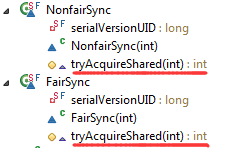

# Semaphore

> 版本 JDK7。如果不做特别说明 AQS 就是 AbstractQueuedSynchronizer。

本文将来看看 Semaphore 的源码，在这之前最好对 [**AQS**](../../mds/concurrency/c-5.md) 有一些了解。

相比较ReentrantLock 和 ReentrantReadWriteLock 而言，Semaphore 的源码看起来会简单的多。

- [1. Semaphore 的用途](#sem-1)
- **2. 源码解读**
  - [2.1 Semaphore 构造](#sem-2-1)
    - [2.1.1 Sync](#sem-2-1-1)
    - [2.1.2 FairSyn与NonfairSync](#sem-2-1-2)
- [3. Semaphore 实战](#sem-usage)

## <a id="sem-1">1. Semaphore 的用途</a>

Semaphore 是用来控制同时访问特定资源的线程数量，他通过协调各个线程，来保证合理的使用 **公共资源**。

### <a id="sem-2-1">2.1 Semaphore 的构造</a>

大概知道(简单了解。。。) Semaphore 的用途之后，让我们来看看，Semaphore 为我们提供的两个构造方法吧。

1. Semaphore(int permits)
```java
/**
 * 创建一个Semaphore对象，默认是非公平模式
 * @param permits, 允许最大并发线程数量。permits也可能为负数，不过在这个之前必须释放掉所有的锁。
 */
public Semaphore(int permits) {
    sync = new NonfairSync(permits);
}
```

2. Semaphore(int permits, boolean fair)
```java
/**
 * 创建一个Semaphore对象
 * @param permits, 允许最大并发线程数
 * @param fair, 指定同步模式
 */
public Semaphore(int permits, boolean fair) {
    sync = fair ? new FairSync(permits) : new NonfairSync(permits);
}
```

看看这两个构造方法的方式是不是有点似曾相识？看看 [ReentrantLock](../../mds/concurrency/c-5-1.md) 和 [ReentrantReadWriteLock](../../mds/concurrency/c-5-2.md) 它们的构造方法也提供了 **公平模式** 与 **非公平模式** 的同步器。

#### <a id="sem-2-1-1">2.1.1 Sync</a>

在讲 FairSync 与 NonfairSync 之前，还是老样子，先来了解一下它们的父类 Sync。 Sync 也与 ReentrantLock、ReentrantReadWriteLock 一样都是继承了 AQS。

下面我们来看看 Semaphore 的内部类 Sync 的实现：

1. 构造方法 **Sync(int)**

```java
Sync(int permits) {
  // 设置了最大并发的线程数，也可以理解成是最大可获取的锁数量
  setState(permits);
}
```

2. **nonfairTryAcquireShared(int)**

看方法的名称就知道，这个方法是用于非公平模式下Semaphore获取锁时会调用的方法。


```java
final int nonfairTryAcquireShared(int acquires) {
  // 无限循环
  for (;;) {
    // 获取当前可用锁数量
    int available = getState();
    // 根据 acquires 来计算，剩余可用锁的数量
    int remaining = available - acquires;
    if (remaining < 0 ||
        compareAndSetState(available, remaining))
        
        // 直到剩余锁的数量小于0 或者 CAS 成功，返回方法
        return remaining;
  }
}
```

nonfairTryAcquireShared 这个方法很简单，就是通过一个 **无限循环**，尝试将锁的状态更新了。只有当没有锁可以用或CAS成功的时候才会返回。

3.  **tryReleaseShared(int)**

看过 AQS 源码就知道，AQS 提供了一些抽象方法供其子类去实现，以满足不同的应用场景。

- tryAcquire(int)
- tryRelease(int)
- tryAcquireShared(int)
- tryReleaseShared(int)
- isHeldExclusively()

Sync 只实现了 tryReleaseShared 方法。这些抽象方法一般都是成对的实现。有了 tryReleaseShared，就说明肯定有 tryAcquireShared 的具体实现。你可能已经想到了，Sync 的子类 FairSync 和 NonFairSync 会去分别的实现(后面会讲到)。



```java
protected final boolean tryReleaseShared(int releases) {
  // 无限循环
  for (;;) {
    int current = getState();
    int next = current + releases;
    if (next < current) // overflow
        throw new Error("Maximum permit count exceeded");
    if (compareAndSetState(current, next))
        return true;
  }
}
```

tryReleaseShared(int) 这个方法也很简单，通过 **无限循环** 的方式来尝试 CAS 将 state 的状态更新，直到 CAS 成功，方法才会退出。

4.  除此之外，Sync 针对 state 还提供了一些处理方法：
    
    - **reducePermits(int)**

    ```java
    /**
     * 根据 reductions 减少可用锁的数量
     * @param reductions, 锁需要被减少的数量
     */
    final void reducePermits(int reductions) {
      // 无限循环
      for (;;) {
        int current = getState();
        int next = current - reductions;
        // 这里就是避免 reductions 为负数
        if (next > current) // underflow
          throw new Error("Permit count underflow");
        if (compareAndSetState(current, next))
          // 直到 CAS 成功，返回方法
          return;
      }
    }
    ```

    - **drainPermits()**

    ```java
    /** 将可用锁清零 **/
    final int drainPermits() {
      for (;;) {
        int current = getState();
        if (current == 0 || compareAndSetState(current, 0))
            return current;
      }
    }
    ```

#### <a id="sem-2-1-2">2.1.2 FairSyn与NonfairSync</a>

上面讲到了 Sync 只重写了 tryReleaseShared(int)，而 tryAcquireShared(int) 交给了它的子类们去实现。下面来看看，它们实现有什么区别？

- **FairSync**

```java
protected int tryAcquireShared(int acquires) {
  // 无限循环
  for (;;) {
    /*
      * 判断当前同步队列中是否已经有线程在等待获取锁
      * 如果有，hasQueuedPredecessors 返回 true，当前线程进入同步队列进行排队
      */
    if (hasQueuedPredecessors())
        return -1;
    
    // 同步队列中没有等待的线程时，下面的逻辑和 nonfairTryAcquireShared(int) 一致
    int available = getState();
    int remaining = available - acquires;
    if (remaining < 0 ||
        compareAndSetState(available, remaining))
        return remaining;
  }
}
```

- **NonfaireSync**

非公平模式下，就显得很简单了。前面我们也已经介绍过 nonfaireTryAcquireShared(int) 这个方法，就不多赘述了。
```java
protected int tryAcquireShared(int acquires) {
  return nonfairTryAcquireShared(acquires);
}
```

看完上面的代码，我们可以很容易的总结出来，公平模式与非公平模式的区别：**就是有没有hasQueuedPredecessors()**。公平模式下就是会检查一下同步队列中是否已经有线程在等待获取锁了，要排队，这个也是遵守了队列的 **FIFO** 规则。而非公平模式下就不需要关心同步队列的状态，直接尝试获取锁。

## <a id="sem-uage">3. Semaphore 实战</a>

下面我们使用 Semaphore 来锁定公共资源，每个线程想要使用共享资源之前都必须先调用 **acquire()** 来获取公共资源的锁。当拥有公共资源锁的线程使用完公共资源时，必须调用 **release()** 来释放公共资源锁。

下面这个例子将会来展示上面的过程：

**Shared.java**：用来表示共享资源的状态
```java
public class Shared {
	static int count = 0;
}
```

**MyThread.java**

```java
/**
 * 创建一个线程内部用Semaphore来控制最大并发数
 */
class MyThread extends Thread {
	
  Semaphore sem;
  String threadName;

  public MyThread(Semaphore sem, String threadName) {
    super(threadName);
    this.sem = sem;
    this.threadName = threadName;
  }

  @Override
  public void run() {

    // run by thread A
    if(this.getName().equals("A")) {

      System.out.println("Starting " + threadName);
      try {
        // print current thread status
        System.out.println(threadName + " is waiting for a permit.");

        // try to acquire the lock
        sem.acquire();

        System.out.println(threadName + " gets a permit.");

        for(int i = 0; i < 5; i++) {
          Shared.count++;
          System.out.println(threadName + " : " + Shared.count);

          // Now, allowing a context switch -- if possible.
          // for thread B to execute
          TimeUnit.MILLISECONDS.sleep(10);
        }
      } catch (InterruptedException e) {
        e.printStackTrace();
      } finally {
        System.out.println(threadName + " releases the permit.");
        sem.release();
      }
    } else { // run by thread B

      System.out.println("Starting " + threadName);

      try {
        System.out.println(threadName + " is waiting for a permit.");
        sem.acquire();
        for(int i = 0; i < 5; i++) {
          Shared.count --;
          System.out.println(threadName + " : " + Shared.count);
          TimeUnit.MILLISECONDS.sleep(10);
        }
      } catch (InterruptedException e) {
        e.printStackTrace();
      } finally {
        System.out.println(threadName + " releases the permit.");
        sem.release();
      }
    }
  }
	
}
```

**SemaphoreDemo.java**：测试

```java
public class SemaphoreDemo {
  public static void main(String[] args) throws InterruptedException {
		
    // only allow one thread to get the lock
    Semaphore sem = new Semaphore(1);

    MyThread ta = new MyThread(sem, "A");
    MyThread tb = new MyThread(sem, "B");

    ta.start();
    tb.start();

    ta.join();
    tb.join();

    System.out.println("count : " + Shared.count);
  }
}
```

**Output**：

> Starting A  
Starting B  
A is waiting for a permit.  
B is waiting for a permit.  
A gets a permit.  
A : 1   
A : 2   
A : 3   
A : 4   
A : 5   
A releases the permit.  
B : 4   
B : 3   
B : 2   
B : 1   
B : 0   
B releases the permit.  
count : 0 

##  [BACK](../../mds/summary.md)