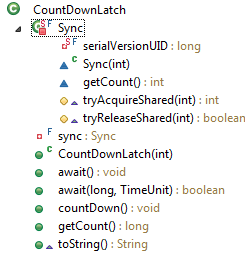

# CountDownLatch

> 版本 JDK7。如果不做特殊说明，AQS 就是 AbstractQueuedSynchronizer。

本文将来看看 CountDownLatch 的源码，在这之前最好对 [**AQS**](../../mds/concurrency/c-5.md) 有一些了解。


-   [1. CountDownLatch 的用途](#cdl-1)
-   [**2. 源码解析**](#cdl-2)
    -   [2.1 Sync](#user-cotent-cdl-2-1)
    -   [2.2 countDown()](#cdl-2-2)
    -   [2.3 await() & await(long, TimeUnit)](#cdl-2-3)
-   [3. CountDownLatch 与 join 之间的区别？](#cdl-3)

## <a id="cdl-1">1. CountDownLatch 的用途</a>

CountDownLatch 允许一个或者多个线程等待其他线程完成的操作。CountDownLatch 就是一个触发器，而这个触发条件是在创建 CountDownLatch 对象的时候指定的，即 CountDownLatch(int count)。这个 **count** 可以理解为，需要 count 个线程完成之后，才会触发唤醒 CountDownLatch。

## <a id="cdl-2">2. 源码解析</a>



如图所见，CountDownLatch 这个类非常的简单。所以，我会每个方法都介绍一遍。

### <a id="cdl-2-1">2.1 Sync</a>

Sync 是 CountDownLatch 唯一的内部静态类。 CountDownLatch 也是众多实现 AQS 并发工具之一。这个从 Sync 的继承关系就可以看得出来。

```java
private static final class Sync extends AbstractQueuedSynchronizer {
    private static final long serialVersionUID = 4982264981922014374L;

    Sync(int count) {
        // 指定需要等待线程的数量
        setState(count);
    }

    int getCount() {
        return getState();
    }

    /**
     * 重写了 AQS 的 tryAcquireShared(int) 方法。
     * state == 0时，返回 1，说明成功获取锁；反之，返回 -1 ， 说明获取锁失败
     * @param acquires, 没有什么用
     */
    protected int tryAcquireShared(int acquires) {
        return (getState() == 0) ? 1 : -1;
    }

    /**
     * 这个方法也不像 ReentrantLock 那样会将state+1，相反会将state-1
     * 这方法如果按照方法名去理解就不太好理解了。
     * 简单点理解，就是每个线程完成自己的工作之后，会调用这个方法，来将 state-1。
     * @param releases, 同样也没有什么用。。，因为确定每次都只会释放一个
     */
    protected boolean tryReleaseShared(int releases) {
        // 无限循环
        for (;;) {
            // 获取当前 state，可以理解为未完成的线程数量
            int c = getState();
            if (c == 0)
                return false;
            int nextc = c-1;
            // 方法到了这里，说明 state != 0
            // 只有 CAS 成功，方法才会退出
            if (compareAndSetState(c, nextc))
                return nextc == 0;
        }
    }
}
```

总结一下，CountDownLatch 中的 Sync 对 AQS 的实现，与之前几篇文章提到的 [ReentrantLock](.../../mds/concurrency/c-5-1.md)、[ReentrantReadWriteLock](.../../mds/concurrency/c-5-2.md) 和 [Semaphore](.../../mds/concurrency/c-5-3.md) 都不一样。

大体上，前面三个类对于 tryAcquireShared(int) 的实现，是 state + 1；对 tryReleaseShared(int) 是 state - 1。

而 CountDownLatch 恰巧是相反的。

可能这样看还是有点混乱，没关系，先继续往下看。

### <a id="cdl-2-2">2.2 countDown()</a>

当线程完成工作之后，会调用 countDown() 这个方法，让 CountDownLatch 更新正在进行的线程数量。

```java
public void countDown() {
    sync.releaseShared(1);
}
```

### <a id="cdl-2-3">2.3 await() & await(long, TimeUnit)</a>

调用 await() 方法的线程会被阻塞(其实就是让调用该方法的下次线程进入同步队列)。直到 CountDownLatch 指定的 count==0 的时候，该线程将被唤醒。

```java
public void await() throws InterruptedException {
    sync.acquireSharedInterruptibly(1);
}

public final void acquireSharedInterruptibly(int arg) throws InterruptedException {
    if (Thread.interrupted())
        throw new InterruptedException();
    // 只要state!=0，tryAcquireShared(int) 就一直返回的是-1。
    if (tryAcquireShared(arg) < 0)
        doAcquireSharedInterruptibly(arg);
}
```

除了 await() 之外， CountDownLatch 还提供了一个重载方法 await(long, TimeUnit)。这个方法就如其名字一样，如果当前调用 await(long, TimeUnit)，在 TimeUnit 指定的时间内还未被唤醒，那么它将自动返回。

```java
public boolean await(long timeout, TimeUnit unit)
    throws InterruptedException {
    return sync.tryAcquireSharedNanos(1, unit.toNanos(timeout));
}

public final boolean tryAcquireSharedNanos(int arg, long nanosTimeout) throws InterruptedException {
    if (Thread.interrupted())
        throw new InterruptedException();
    
    // state == 0 或 等待超时，就会返回方法
    return tryAcquireShared(arg) >= 0 ||
        doAcquireSharedNanos(arg, nanosTimeout);
}
```

## <a id="cdl-3">3. CountDownLatch 与 join 之间的区别？</a>

你可能会注意到 CountDownLatch 与 Thread.join() 这个方法的功能有相似之处。但是它们之间什么区别呢？

1.   **应用场景一：**

> 假设一条流水线上有三个工作者：worker0，worker1，worker2。有一个任务的完成需要他们三者协作完成，worker2可以开始这个任务的前提是worker0和worker1完成了他们的工作，而worker0和worker1是可以 **并行** 他们各自的工作的。

-   join() 来模拟场景一

根据 **happens-before** 规则描述：如果线程 A 执行操作 ThreadB.join() 并成功返回，那么线程 B 中的任意操作 happens-before 于线程 A 从 ThreadB.join() 操作成功返回。意思就是，线程 A 在调用 ThreadB.join() 之后将被阻塞，直到 ThreadB.join() 成功返回，才会继续执行线程 A 的后续操作。

**Workers.java**

```java
public class Workers extends Thread {
	
    private String name;

    private long time;

    public Workers(String name, long time) {
        this.name = name;
        this.time = time;
    }

    @Override
    public void run() {
        try {
            System.out.println(name + " start  the work.");
            TimeUnit.MILLISECONDS.sleep(time);
            System.out.println(name + " finish the work and it takes " + time);
        } catch (InterruptedException e) {
            e.printStackTrace();
        }
    }

}
```

**Test.java**

```java
public class Test {
    public static void main(String[] args) throws InterruptedException {
        Workers worker0 = new Workers("worker0", (long) (Math.random()*2000+3000));
        Workers worker1 = new Workers("worker1", (long) (Math.random()*2000+3000));
        Workers worker2 = new Workers("worker2", (long) (Math.random()*2000+3000));

        worker0.start();
        worker1.start();

        worker0.join();
        worker1.join();
        System.out.println("start the main thread work");

        worker2.start();
    }
}
```

**Output：**

> worker0 start  the work.  
worker1 start  the work.    
worker0 finish the work and it takes 3837   
worker1 finish the work and it takes 4000   
start the main thread work  
worker2 start  the work.    
worker2 finish the work and it takes 4829   

-   CountDownLatch 来模拟场景一

**Workers.java**

```java
public class Workers extends Thread {
	
    private String name;

    private long time;

    private CountDownLatch countDownLatch;

    public Workers(String name, long time, CountDownLatch countDownLatch) {
        this.name = name;
        this.time = time;
        this.countDownLatch = countDownLatch;
    }

    @Override
    public void run() {
        try {
            System.out.println(name + " start  the work.");
            TimeUnit.MILLISECONDS.sleep(time);
            System.out.println(name + " finish the work and it takes " + time);
            countDownLatch.countDown();
            System.out.println("there is still " + countDownLatch.getCount() + " workers to be done.");
        } catch (InterruptedException e) {
            e.printStackTrace();
        }
    }

}
```

**Test.java**

```java
public class Test {
    public static void main(String[] args) throws InterruptedException {
        CountDownLatch countDownLatch = new CountDownLatch(2);
        Workers worker0 = new Workers("worker0", (long) (Math.random()*2000+3000), countDownLatch);
        Workers worker1 = new Workers("worker1", (long) (Math.random()*2000+3000), countDownLatch);
        Workers worker2 = new Workers("worker2", (long) (Math.random()*2000+3000), countDownLatch);

        worker0.start();
        worker1.start();

        countDownLatch.await();
        System.out.println("start the main thread work");

        worker2.start();
    }
}
```

**Output：**

> worker0 start  the work.  
worker1 start  the work.    
worker0 finish the work and it takes 3481   
there is still 1 workers to be done.    
worker1 finish the work and it takes 3586   
there is still 0 workers to be done.    
start the main thread work  
worker2 start  the work.    
worker2 finish the work and it takes 4309   
there is still 0 workers to be done.    

到目前为止，CountDownLatch 与 join 的功能都是可以相互替换的。既然如此，CountDownLatch 与 join 的区别到底在哪里呢？

下面来看看场景二

-   **场景二：**

> 假设 worker 的工作可以分为两个阶段，work2 只需要等待 work0 和 work1 完成他们各自工作的第一个阶段之后就可以开始自己的工作了，而不是场景1中的必须等待 work0 和 work1 把他们的工作全部完成之后才能开始。

在这种场景下，join 是不能实现这种功能。但对于 CountDownLatch 而言，就只是调用 countDown() 的位置需要提前一下即可。

**Workers.java**
```java
public class Workers extends Thread {
	
    private String name;

    private long time;

    private CountDownLatch countDownLatch;

    public Workers(String name, long time, CountDownLatch countDownLatch) {
        this.name = name;
        this.time = time;
        this.countDownLatch = countDownLatch;
    }

    @Override
    public void run() {
        try {
            System.out.println(name + " start  the work.");
            TimeUnit.MILLISECONDS.sleep(time);
            System.out.println(name + " : the first stage is completed and it takes " + time);

            countDownLatch.countDown();

            TimeUnit.SECONDS.sleep(2);
            System.out.println(name + ": the second stage is completed and it takes " + (time+2*1000));
        } catch (InterruptedException e) {
            e.printStackTrace();
        }
    }

}
```

测试 Test.java 不变。

**Output：**

> worker0 start  the work.  
worker1 start  the work.    
worker0 : the first stage is completed and it takes 3201    
worker1 : the first stage is completed and it takes 4433    
start the main thread work  
worker2 start  the work.    
worker0: the second stage is completed and it takes 5201    
worker1: the second stage is completed and it takes 6433    
worker2 : the first stage is completed and it takes 4320    
worker2: the second stage is completed and it takes 6320    

## 参考

-   [CountDownLatch理解一：与join的区别](https://blog.csdn.net/zhutulang/article/details/48504487)

##  [BACK](../../mds/summary.md)