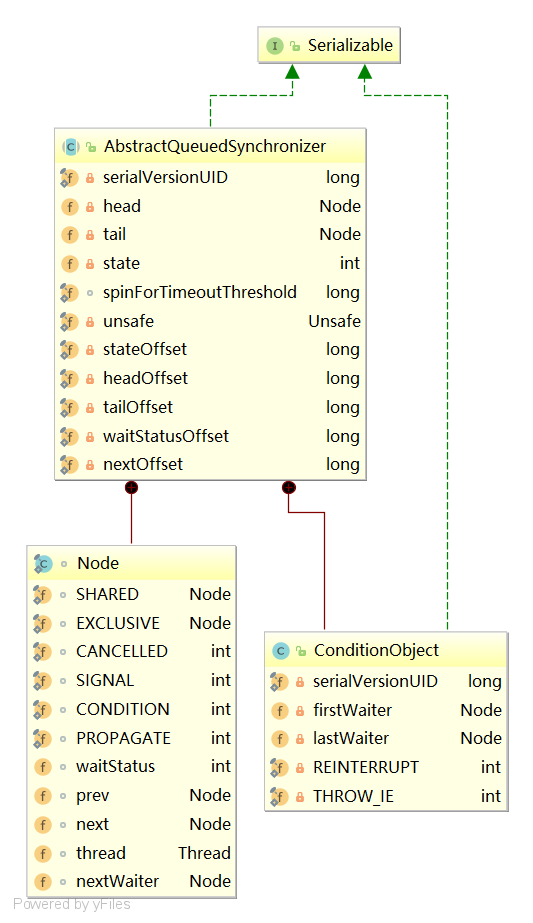
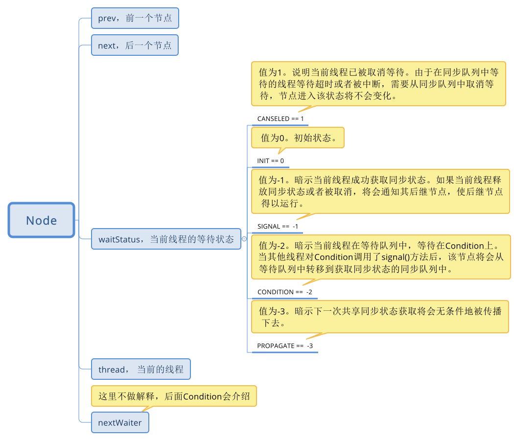
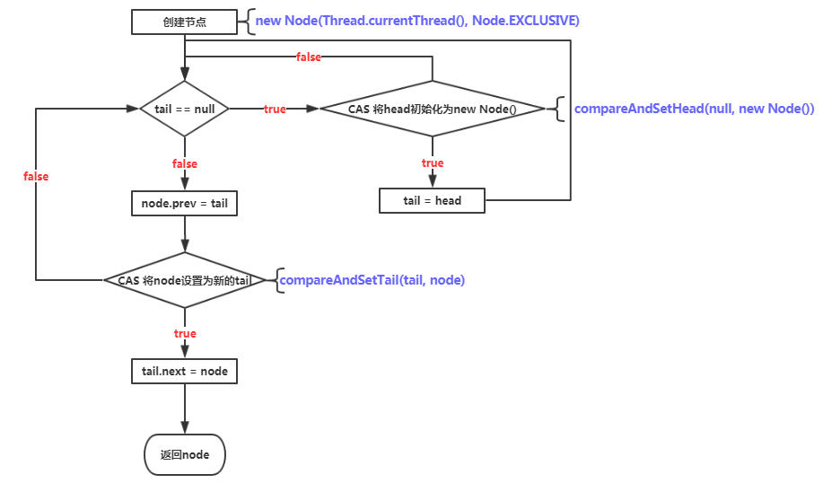
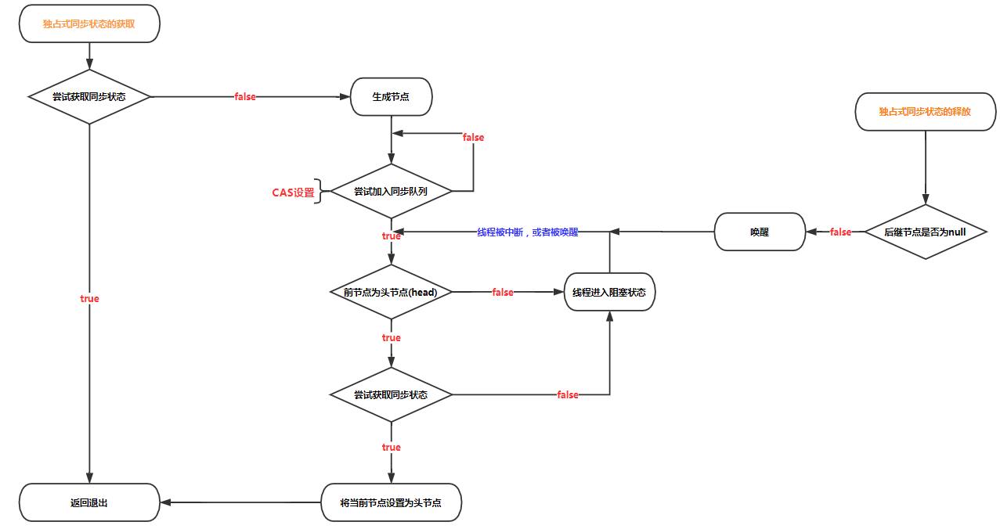

# AbstractQueuedSynchronizer

> 参阅版本号: JDK7

-   [1. AQS 是什么？](#aqs-1)
    -   [1.1 锁与同步器之间的关系](#aqs-1-1)
    -   [1.2 AQS 的继承结构](#aqs-1-2)
-   [2. AQS 提供的接口与模板方法介绍](#aqs-2)
    -   [2.1 AQS 提供的接口](#aqs-2-1)
    -   [2.2 AQS 提供的模板方法](#aqs-2-2)
-   [3. AQS 的代码实现](#aqs-3)
    -   [3.1 同步队列](#aqs-3-1)
    -   [3.2 独占式同步状态的获取](#aqs-3-2)
        -   [3.2.1 加入同步队列 - addWaiter](#aqs-3-2-1)
        -   [3.2.2 自旋获取同步状态 - acquireQueued](#aqs-3-2-2)
        -   [3.2.3 判断是否需要阻塞线程 - shouldParkAfterFailedAcquire & parkAndCheckInterrupt](#aqs-3-2-3)
        -   [3.2.4 小结 - 独占式同步状态的获取](#aqs-3-2-4)
    -   [3.3 独占式同步状态的释放](#aqs-3-3)
    -   [3.4 总结 - 独占式同步状态的获取与释放](#aqs-exculsive-summary)
    -   [3.5 共享式同步状态的获取与释放](#aqs-3-5)
        -   [3.5.1 doReleaseShared](#aqs-3-5-1)
        -   [3.5.2 unparkSuccessor](#aqs-3-5-2)
        -   [3.5.3 releaseShared](#aqs-3-5-2)

## <a id="aqs-1">1. AQS 是什么？</a>

**AbstractQueuedSynchronizer** (下面简称AQS或同步器)是分析 **java.util.concurrency** 源码所必须要了解的一个类。 AQS 是用来构建锁或者其他同步组件的 **基础框架**，例如 **ReentranLock**、**ReadWriteLock**、**Semaphore**等。

AQS 是通过内置的 **FIFO队列** (FIRST IN FIRST OUT)来完成资源在各个线程之间的分配工作，即决定了哪些线程能够获取资源，哪些线程处于等待、中断或者退出等待等状态。

### <a id="aqs-1-1">1.1 锁与同步器之间的关系</a>

-   锁是面向 **使用者**。它定义了使用者与锁交互的接口(比如可以允许两个线程并行访问)，隐藏了实现细节。
-   同步器是面向 **实现者**。它简化了锁的实现方式，屏蔽了同步状态管理、线程的排队、等待与唤醒等 **底层操作**。

### <a id="aqs-1-2">1.2 AQS 的继承结构</a>



由图上可知，AbstractQueuedSynchronizer 有 ConditionObject 和 Node 这两个内部类，后面将会介绍到它们。

## <a id="aqs-2">2. AQS 提供的接口与模板方法介绍</a>

AQS 是基于 [模板方法](../../mds/design-patterns/ds-behavior-0.md) 模式来设计的。AQS 为锁的实现者们暴露了一些接口和模板方法。下面来看一下 AQS 为我们提供了哪些接口和模板方法。

### <a id="aqs-2-1">2.1 AQS 提供的接口</a>


就暴露出了5个可重写的接口，不实现将会抛出 **`UnsupportedOperationException`**。

```java
protected boolean tryAcquire(int arg) {
    throw new UnsupportedOperationException();
}
protected boolean tryRelease(int arg) {
        throw new UnsupportedOperationException();
}
protected int tryAcquireShared(int arg) {
    throw new UnsupportedOperationException();
}
protected boolean tryReleaseShared(int arg) {
    throw new UnsupportedOperationException();
}
protected boolean isHeldExclusively() {
    throw new UnsupportedOperationException();
}
```

| 方法名 | 作用 |
| :--: | :--: |
| protected boolean tryAcquire(int arg) | **独占式获取同步状态** |
| protected boolean tryRelease(int arg) | **独占式释放同步状态** |
| protected int tryAcquireShared(int arg) | **共享式获取同步状态** |
| protected boolean tryReleaseShared(int arg) | **共享式释放同步状态**|
| protected boolean isHeldExclusively() | 判断当前同步器是否在 **独占模式** 下被线程占用 |

### <a id="aqs-2-2">2.2 AQS 提供的模板方法</a>

AQS 提供的模板方法主要分为 **3** 类：

1.   独占式获取与释放同步状态
2.   共享式获取与释放同步状态
3.   查询同步队列中的等待线程情况

下面罗列出部分的模板方法：

| 方法名 | 作用 |
| :--: | :--: |
| public final void acquire(int arg) | 独占式获取同步状态,对中断不敏感(具体请看后面的详解)。如果当前线程获取同步状态成功，则由这个方法返回；否则，将会进入同步队列等待。 |
| public final void acquireInterruptibly(int arg) throws InterruptedException | 与 **acquire(int arg)** 作用相同都是独占式获取同步状态，但是这个方法是响应中断。这个方法在下面2种情况能够返回：1. 成功获取同步状态；2. 当前线程被中断，抛出异常退出。 |
| public final **boolean** tryAcquireNanos(int arg, long nanosTimeout) throws InterruptedException | 在 **acquireInterruptibly(int arg)** 的基础上加上了时间限制。这个方法在下面3种情况能够返回：1. 在规定的时间内获取同步状态，返回 **true**；2. 当前线程被中断，抛出异常退出；3. 获取同步状态超时，返回 **false**。 |
| public final **boolean** release(int arg) | 独占式释放同步状态。成功释放，返回 **true**；否则，返回 **false**。 |
| public final void acquireShared(int arg) | 共享式获取同步状态，对中断不敏感。如果当前线程未获取到同步状态，将会进入到同步队列等待。与 **独占式** 获取同步状态的主要区别是在同一时刻可以有多个线程获取到同步状态。 |
| public final void acquireSharedInterruptibly(int arg) throws InterruptedException | 与 **acquireShared(int arg)** 作用相同都是共享式获取同步状态，同时，增加了响应线程中断。 |
| public final **boolean** tryAcquireSharedNanos(int arg, long nanosTimeout) throws InterruptedException | 在 **acquireSharedInterruptibly(int arg)** 的基础上加上了时间限制。 |
| public final **boolean** releaseShared(int arg) | 共享式释放同步状态。成功释放，返回 **true**；否则，返回 **false**。 |

## <a id="aqs-3">3. AQS 的代码实现</a>

前面讲了 AQS 的各种功能，下面我们从代码实现来看看同步器是如何完成线程同步的。

### <a id="aqs-3-1">3.1 同步队列</a>

同步器是依赖于内部的同步队列来完成对同步状态的管理，下面就来了解 Node 的构造。Node 是 AbstractQueuedSynchronized 的一个内部静态类。



同步队列的基本结构如下：


> 可能会很好奇为什么头节点的 **prev** 怎么不会指向 **head**？ 继续往下看就有答案。

### <a id="aqs-3-2">3.2 独占式同步状态的获取</a>

上面我们介绍了 **acquire(int arg)** 是一个对中断不敏感的获取同步状态的方法。那么就来看看它在代码中是如何实现的。

```java
public final void acquire(int arg) {
    if (!tryAcquire(arg) &&
        acquireQueued(addWaiter(Node.EXCLUSIVE), arg))
        selfInterrupt();
}
```

**tryAcquire** 这个方法是需要实现锁的人来具体实现，这里不必关心其具体实现，只需要知道它会尝试获取独占锁。成功获取返回 **true**；否则，返回 **false**。

如果获取失败，当前线程将通过 **addWaiter(Node.EXCLUSIVE)** 插入到同步队列的 **末尾**。再通过 **acquireQueued** 来 **自旋** 获取同步状态。

#### <a id="aqs-3-2-1">3.2.1 addWaiter - 将当前线程对应的节点加入到同步队列中</a>

同步队列 Node 为我们提供了 3 个构造函数，分别有不同的作用：

```java
// 建立初始化 head 或 SHARED 标记会用到
Node() {
}

// addWaiter 会用到
Node(Thread thread, Node mode) { 
    this.nextWaiter = mode;
    this.thread = thread;
}

// Condition 会用到
Node(Thread thread, int waitStatus) {
    this.waitStatus = waitStatus;
    this.thread = thread;
}
```

了解 Node 的 3 个构造函数，可以来看一下 addWaiter(Node, Node) 是如何将节点加入到同步队列中。

```java
private Node addWaiter(Node mode) {
    // 创建一个节点，因为这里是独占式，所以将等待队列设置为null
    Node node = new Node(Thread.currentThread(), mode);
    
    // 获取尾节点，
    Node pred = tail;

    // 如果当前同步队列的尾部不为 null，则尝试将 node 快速添加到同步队列的尾部
    if (pred != null) {

        // node的前节点指向当前同步队列的尾部
        node.prev = pred;

        // 尝试通过 CAS 来将 node 插入到同步队列的尾部
        if (compareAndSetTail(pred, node)) {
            // CAS 成功将 node 设置为 tail 并且将更新前的尾部节点的后继节点指向当前 node 节点。
            pred.next = node;
            return node;
        }
    }

    /** 
     * 执行到 enq(Node) 这里有 2 种情况：
     * 1. tail == null，说明同步队列未初始化
     * 2. 快速插入同步队列失败
     */
    // 通过无限循环配合 CAS 将节点 node 插入到同步队列的尾部
    enq(node);
    return node;
}
```

**enq(Node)** 是通过“死循环”将节点插入同步队列尾部。

```java
private Node enq(final Node node) {
    for (;;) {
        // 获取当前同步队列的尾节点
        Node t = tail;
        // 判断尾节点是否初始化
        if (t == null) {

            // 进行初始化同步队列
            if (compareAndSetHead(new Node()))
                // 若成功 CAS，初始化同步器
                tail = head;
        } else {
            // 将 node 的前节点指向当前同步队列的尾节点 tail
            node.prev = t;
            // 尝试 CAS 来将 node 设置为当前同步队列的尾节点 tail
            if (compareAndSetTail(t, node)) {
                // CAS 成功，将 tail 节点的 next 指向现在的 node
                t.next = node;
                return t;
            }
        }
    }
}
```

流程图如下：



### <a id="aqs-3-2-2">3.2.2 acquireQueued</a>

```java
// final 修饰node，避免node被重复赋值
/**
 * @param node，注意这个 node 是前面新添加到同步队列中的节点
 */
final boolean acquireQueued(final Node node, int arg) {
    // 获取同步状态是否失败，true为失败，false为成功
    boolean failed = true;
    try {
        // 当前线程是否被中断，true为被中断，flse未被中断
        boolean interrupted = false;

        // 进入无限循环
        for (;;) {
            // 获取当前线程的前节点
            final Node p = node.predecessor();

            // 只有前节点为 head 的时候才有资格去获取同步状态，这样也是为了维护队列的 FIFO 原则
            if (p == head && tryAcquire(arg)) {
                // 成功获取同步状态，将同步队列头部 head 设置为 node，同时释放当前节点不适用的资源
                // 这也是上面示例图中，为什么头节点的 prev 没有指向，因为没有什么用。
                setHead(node);

                // 将旧的头节点从同步队列中脱离出来
                p.next = null; // help GC
                failed = false;
                return interrupted;
            }

            // 代码执行到这里的情况：
            // 1. 获取同步状态失败
            // 2. 前驱节点不是 head 节点
            // 判断当前线程是否需要阻塞（这个是根据其前节点的等待状态来决定的）以及当前线程是否被标记被中断状态
            if (shouldParkAfterFailedAcquire(p, node) &&
                parkAndCheckInterrupt())
                interrupted = true;
        }
    } finally {
        // 如果当前线程在获取同步状态的时候出现异常退出的情况，取消获取同步状态
        if (failed)
            cancelAcquire(node);
    }
}
```

> 思考：为什么有finally的存在，还需要通过cancelAcquire(Node)来将当前尝试获取同步状态的节点从同步队列中剥离出去？

看似 **acquireQueued** 这个方法除了成功获取同步状态能够返回，好像没有其他的情况会退出方法。实际上 **tryAcquire** 这个方法是有可能会抛出异常的，比如 AQS 的实现类 ReentrantLock 中非公平模式的 tryAcquire 实现。这个时候，就需要对同步队列做一些更新，包括将当前节点从同步队列中清除出去。

下面是 **ReentrantLock** 中实现的 **tryAcquire**：

```java
final boolean nonfairTryAcquire(int acquires) {
    final Thread current = Thread.currentThread();
    int c = getState();
    if (c == 0) {
        if (compareAndSetState(0, acquires)) {
            setExclusiveOwnerThread(current);
            return true;
        }
    }
    else if (current == getExclusiveOwnerThread()) {
        int nextc = c + acquires;
        if (nextc < 0) // overflow
            throw new Error("Maximum lock count exceeded");
        setState(nextc);
        return true;
    }
    return false;
}
```

### <a id="aqs-3-2-3">3.2.3 shouldParkAfterFailedAcquire & parkAndCheckInterrupt</a>

在尝试获取同步状态 **失败** 之后会调用 **shouldParkAfterFailedAcquire**， 该方法根据前节点的 **waitStatus** 来决定 **当前节点的线程** 是否需要被阻塞。

> 注意：shouldParkAfterFailedAcquire 不是实际对线程进行阻塞的方法，只是根据这个方法返回的 boolean 值来确定是否进行阻塞（true：需要阻塞；false 不需要阻塞）。

```java
/**
 * 检查并更新当前节点以及当前节点的前驱节点的状态
 * @param pred, node 的前驱节点
 * @param node, node 节点
 */
private static boolean shouldParkAfterFailedAcquire(Node pred, Node node) {
    // 获取前驱节点的等待状态
    int ws = pred.waitStatus;

    // 前驱节点的等待状态为-1，说明前节点正常运行中，当前节点需要被阻塞
    if (ws == Node.SIGNAL)
        return true;
    
    /**
     * 前驱节点的等待状态 > 0
     * 前面我们了解过 Node 的结构，知道等待状态大于 >0 的情况只有为1的时候
     * 这个时候说明前节点已经被取消等待。
     * 面对这种情况，当前节点就需要重新找一个新的前驱节点。
     * 下面的做法就是顺着前驱节点往前找，一直找到 waitstatus < 0 的节点，作为当前节点新的前驱节点。
     * 返回 false，当前节点不必被阻塞
     */ 
    if (ws > 0) {
        
        do {
            node.prev = pred = pred.prev;
        } while (pred.waitStatus > 0);
        pred.next = node;
    } else {
        
        /**
         * 进入这个分支，说明前节点的等待状态既不是-1，也不是1。
         * 那么这个时候前节点的等待状态有可能为 0，-2，-3。官方给出的答案是只有可能为 0 或 -3。
         * 为什么没有可能为 -2 呢？这个是只用于等待队列的。
         */
        compareAndSetWaitStatus(pred, ws, Node.SIGNAL);
    }
    return false;
}
```

总结一下，shouldParkAfterFailedAcquire 做了 2 件事情：

1.  检查或更新节点的状态
    
    1.  如果前节点取消等待，那么及时为当前节点找一个新的前驱节点。

    1.  将前节点的等待状态设置为 SIGNAL，这样做的目的就是：一旦这个前驱节点释放锁的时候，能够及时唤醒当前节点，让它去执行代码。

1.  判断当前节点对应的线程是否需要被 **阻塞**。

    其前驱节点的等待状态为 SIGNAL 时，当前线程被阻塞，否则不需要。

#### parkAndCheckInterrupt()

```java
private final boolean parkAndCheckInterrupt() {
    // 阻塞当前线程
    LockSupport.park(this);
    // 返回当前线程的中断状态，并且清除其中断状态
    return Thread.interrupted();
}
```

-   parkAndCheckInterrupt 内部调用了 **Thread.interrupted()**。

-   最后在 **acquire(int)** 块结束的时候，根据 **acquireQueued** 返回当前线程的中断状态，来决定是否调用 **selfInterrupt** 来将当前线程的中断状态恢复。

### <a id="aqs-3-2-4">3.2.4 小结 - 独占式同步状态的获取</a>

看完整个 acquire(int) 方法的内部实现，终于可以解释为什么 acquire(int) 对中断方法不敏感。

这是由于线程获取同步状态失败之后进入同步队列中，后续对线程进行中断操作时，线程不会从同步队列中移出。

### <a id="aqs-3-3">3.3 独占式同步状态的释放</a>

```java
public final boolean release(int arg) {
    if (tryRelease(arg)) { // 尝试释放同步状态成功
        // 获取head指向的节点
        Node h = head;
        if (h != null && h.waitStatus != 0)
            // 唤醒head的后继节点
            unparkSuccessor(h);
        return true;
    }
    return false;
}
```
unparkSuccessor 尝试去唤醒 head 的后继节点。
```java
private void unparkSuccessor(Node node) {
    
    // 获取当前节点的等待状态
    int ws = node.waitStatus;
    
    if (ws < 0)
        // 尝试将节点的等待状态设置成0
        compareAndSetWaitStatus(node, ws, 0);

    // 获取下一个节点
    Node s = node.next;

    // 下面这个 if 分支主要就是检查后继节点是否还在同步队列中，如果不在就在同步队列中找个合适的节点
    // 如果后继节点为 null 或者被取消等待
    // 那么就顺着同步队列从后往前遍历，尝试找到一个不为null且等待状态小于等于0的节点
    // 如果找到，那么将这个节点作为head的后继节点
    if (s == null || s.waitStatus > 0) {
        s = null;
        for (Node t = tail; t != null && t != node; t = t.prev)
            if (t.waitStatus <= 0)
                s = t;
    }

    // 如果 head 的后继节点不为 null，就将其从阻塞状态中唤醒。
    if (s != null)
        LockSupport.unpark(s.thread);
}
```

这里，我们可以看到在 ` unparkSuccessor(Node)` 这个唤醒后继节点的方法中，会去 **尝试** 将 `head` 节点的等待状态更新成 0，即初始状态。这里就是算失败也无所谓。

因为主要的工作还是唤醒后继节点，所以当前 `head` 节点的状态主要是在上面我们介绍过的 `acquireQueued(Node)` 方法中进行。

### <a id="aqs-exculsive-summary">3.4 总结 - 独占式同步状态的获取与释放</a>

就用图示对上面介绍的独占式同步状态的获取与释放做个简单的总结：



### <a id="aqs-3-5">3.5 共享式同步状态的获取</a>

> 共享式获取同步状态与独占式获取同步状态最主要的区别在于：**同一时刻** 能否有多个线程同时获取到同步状态。

下面来看一下其中最普通的一种获取共享式同步状态的方法 - **acquireShared(int arg)**。

```java
public final void acquireShared(int arg) {
    // 若tryAcquireShared 返回大于等于0，说明成功获取同步状态
    if (tryAcquireShared(arg) < 0)
        doAcquireShared(arg);
}
```

若获取同步状态失败，那么进入到 **doAcquireShared(arg)**。

```java
private void doAcquireShared(int arg) {
    // 为当前线程生成节点（其模式为共享式），并将该节点添加到同步队列中。
    final Node node = addWaiter(Node.SHARED);

    // 获取同步状态的标志，默认为 false。
    boolean failed = true;
    try {

        // 当前线程的中断状态，默认为 false。
        boolean interrupted = false;

        // 开始无限循环，尝试让当前线程获取同步状态。
        for (;;) {
            
            // 获取当前节点的前驱节点
            //用 final 来修饰这个前驱节点就是为了避免这个前驱节点在并发的时候被其他线程改变
            final Node p = node.predecessor();
            
            // 只有前驱节点为 head 的时候（和独占式一样），才会去尝试获取同步状态
            if (p == head) {

                // tryAcquireShared 返回的是还剩余可以共享的资源个数
                int r = tryAcquireShared(arg);

                if (r >= 0) {// 说明还有资源或者资源刚好用完
                    // 后面会介绍这个方法，现在只需知道这个方法是用来将 node 设置为头节点 head，并且尝试唤醒其后继节点
                    setHeadAndPropagate(node, r);
                    p.next = null; // help GC
                    
                    if (interrupted)
                        // 将当前线程标记成中断状态
                        selfInterrupt();
                    failed = false;
                    return;
                }
            }
            if (shouldParkAfterFailedAcquire(p, node) &&
                parkAndCheckInterrupt())
                interrupted = true;
        }
    } finally {
        if (failed)
            cancelAcquire(node);
    }
}
```

再来回顾一下 `shouldParkAfterFailedAcquire` 方法。这个方法是在线程尝试获取同步状态 **失败** 的时候会调用，在独占式获取同步状态（acquireQueued）中也有调用这个方法。

在 `doAcquireShared` 中调用的 `shouldParkAfterFailedAcquire` 可能会执行到下面两个分支：

```java
/**
 * @param pred，前驱节点
 * @param node，当前节点
 */
private static boolean shouldParkAfterFailedAcquire(Node pred, Node node) {
    // ws，前驱节点的等待状态
    int ws = pred.waitStatus;
    if (ws == Node.SIGNAL)
        /*
         * This node has already set status asking a release
         * to signal it, so it can safely park.
         * 前驱节点的等待状态已经被设置成 SIGNAL，当前节点可以安全地阻塞住。
         */
        return true;
    if (ws > 0) {
        /*
         * Predecessor was cancelled. Skip over predecessors and
         * indicate retry.
         * 前驱节点已经被取消。从后往前遍历整个同步队列，直到找到一个还未被取消的节点
         * 将其设置成当前节点的前驱节点
         */
        do {
            node.prev = pred = pred.prev;
        } while (pred.waitStatus > 0);
        pred.next = node;
    } else {
        /*
         * waitStatus must be 0 or PROPAGATE.  Indicate that we
         * need a signal, but don't park yet.  Caller will need to
         * retry to make sure it cannot acquire before parking.
         * 现在这里应该能够看得懂为什么这里可能会有 PROPAGATE 的可能了吧
         * 0 是独占式节点的初始值，PROPAGATE 是共享式节点的初始值
         */
        compareAndSetWaitStatus(pred, ws, Node.SIGNAL);
    }
    return false;
}
```

doAcquireShared 与 acquireQueued 的异同：

同：
1.  只有前继节点是 **head** 的时候，当前节点才能够尝试获取同步状态。
1.  新加入同步队列的节点都会将其前驱节点的 waitStatus 改成 SIGNAL。

异：
1.  doAcquireShared：
    
    1.  doAcquireShared 在同步队列中的节点成功获取同步状态之后，会根据其后继节点是否为 **shared** 的状态，来尝试释唤醒其后继节点。
    1.  doAcquireShared 内部调用了 **setHeadAndPropagate**，会将这个获取的共享状态传播到其后续节点，直到不能传播为止。
1.  acquireQueued：

    1.  acquireQueued 在成功获取同步状态之后，是不会进行传播共享状态，而是直接返回方法。

#### setHeadAndPropagate

```java
/**
 * @param node，当前节点
 * @param propagate，剩余可用共享资源个数
 */
private void setHeadAndPropagate(Node node, int propagate) {
    Node h = head; // Record old head for check below
    // 将当前节点设置为头节点
    setHead(node);
    // 根据propagate的值和其后继节点的是否为shared来决定是否尝试去唤醒其后继节点
    if (propagate > 0 || h == null || h.waitStatus < 0) {
        Node s = node.next;
        if (s == null || s.isShared())
            doReleaseShared();
    }
}
```

setHeadAndPropagate 会根据是否还有资源可供后续节点获取(propagate > 0的情况)，来将这个获取状态传播下去。

#### <a id="aqs-3-5-1">3.5.1 doReleaseShared</a>

```java
private void doReleaseShared() {
    for (;;) {
        Node h = head;
        if (h != null && h != tail) {
            int ws = h.waitStatus;
            if (ws == Node.SIGNAL) {
                // 进入这个分支，说明 head 后面已经有节点加入
                if (!compareAndSetWaitStatus(h, Node.SIGNAL, 0))
                    continue;// head节点状态被改变，重新检查head的等待状态
                // CAS 成功将head节点的等待状态设置成0之后，会去尝试唤醒其后继节点
                unparkSuccessor(h);
            }

            // 代码执行到这里，说明此时同步队列中只有一个节点，即 head == tail，
            // 且这个节点的等待状态为 0（初始状态）
            else if (ws == 0 &&
                        !compareAndSetWaitStatus(h, 0, Node.PROPAGATE))
                // CAS 失败，说明有其他节点加入到同步队列中，
                // 从而触发了当前节点的等待状态发生变化，需要重新循环检查
                continue;// loop on failed CAS
        }
        if (h == head)// 如果 head 改变了，就继续循环
            break;
    }
}
```

回顾一下 doReleaseShared 这个方法，它做了两件事情：

1. 修改了 head 节点的等待状态(SIGNAL -> 0 -> PROPAGATE)。
2. 尝试将 head 的后继节点从阻塞状态中唤醒。

#### <a id="aqs-3-5-2">3.5.2 unparkSuccessor</a>

前面 `doReleaseShared` 方法中调用了 `unparkSuccessor` 这个方法，下面我们来看看这个方法的内部实现。

```java
/**
 * @param node，头节点 head
 */
private void unparkSuccessor(Node node) {
    
    // 获取头节点的等待状态
    int ws = node.waitStatus;

    // 通过 CAS 将 head 节点的等待状态更新成 0。
    // 在并发环境下，这个 CAS 可能会失败，不过没有什么影响
    if (ws < 0)
        compareAndSetWaitStatus(node, ws, 0);

    // 获取下一个节点
    Node s = node.next;
    if (s == null || s.waitStatus > 0) {
        // 后继节点被取消，从后往前遍历同步队列直到找到合适的后继节点
        s = null;
        for (Node t = tail; t != null && t != node; t = t.prev)
            if (t.waitStatus <= 0)
                s = t;
    }
    if (s != null)
        // 唤醒后继节点对应的线程
        LockSupport.unpark(s.thread);
}
```

#### <a id="aqs-3-5-3">3.5.3 releaseShared</a>

看完前面的共享式同步状态的获取，再来看看共享式同步状态的释放就很简单了。

```java
public final boolean releaseShared(int arg) {
    if (tryReleaseShared(arg)) {
        // 修改head节点的等待状态，并尝试唤醒后继节点
        doReleaseShared();
        return true;
    }
    return false;
}
```

##   参考
-   《Java并发编程的艺术 - 第五章》
-   [一行一行源码分析清楚AbstractQueuedSynchronizer](https://javadoop.com/post/AbstractQueuedSynchronizer)
-   [聊聊高并发](https://blog.csdn.net/ITer_ZC/article/details/40868529)

##  [BACK](../../mds/summary.md)