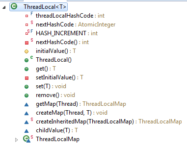
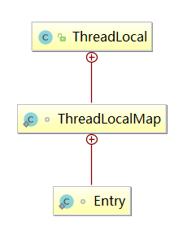

# ThreadLocal

> 版本：JDK7

-   **1. 源码解析**
    -   [1.1 get()](#code-1-1)
    -   [1.2 set()](#code-1-2)
-   [2. 实战](#code-2)
    -   [2.1 使用场景](#code-2-1)

ThreadLocal，即线程变量，是一个以 ThreadLocal 对象为键，任意对象为值的 **键值对** 存储结构。这个结构被附带在线程上，也就是说一个线程可以根据其内部的 ThreadLocal 对象查询到绑定在这个线程上的一个值。

下面来介绍一下 ThreadLocal 中几个重要的方法，了解了这些方法基本就知道 ThreadLocal 是如何运作的了。



## <a id="code-1-1">1.1 get()</a>

get() 是用来获取保存在当前线程中的副本变量。

```java
public T get() {
    // 获取当前线程
    Thread t = Thread.currentThread();

    // 根据获取当前线程的ThreadLocalMap
    ThreadLocalMap map = getMap(t);

    if (map != null) {
        // 查找以ThreadLocal对象为键值的Entry
        ThreadLocalMap.Entry e = map.getEntry(this);
        if (e != null)
            // 找到的话，就返回value
            return (T)e.value;
    }
    // 返回初始值
    return setInitialValue();
}
```

get() 内部调用了 getMap(Thread)、ThreadLocalMap.getEntry(ThreadLocal) 和 setInitialValue() 这三个方法，下面来逐个看看其细节实现。

### getMap(Thread)

```java
ThreadLocalMap getMap(Thread t) {
    return t.threadLocals;
}
```

顺着 t.threadLocals 找，你会发现原来这个 **threadLocals** 就是 **ThreadLocal.ThreadLocalMap** 的一个对象。

```java
ThreadLocal.ThreadLocalMap threadLocals = null;
```

继续看，这个 ThreadLocalMap 里面存着什么？ 这就需要看看下面调用的方法 getEntry(ThreadLocal)。

### getEntry(ThreadLocal)

```java
private Entry getEntry(ThreadLocal key) {
    // 计算key对应的数组下标
    int i = key.threadLocalHashCode & (table.length - 1);
    // 获取entry
    Entry e = table[i];
    if (e != null && e.get() == key)
        // 如果存在entry并且entry里面的ThreadLocal对象就是当前这个ThreadLocal对象的时候，返回entry
        return e;
    else
        return getEntryAfterMiss(key, i, e);
}
```

### setInitialValue()

```java
private T setInitialValue() {
    // 初始化本地线程变量，默认的方法是返回null，
    // 需要子类实现需要初始化的变量
    T value = initialValue();
    Thread t = Thread.currentThread();
    ThreadLocalMap map = getMap(t);
    if (map != null)
        // ThreadLocalMap已经初始化，将初始值设置进去
        map.set(this, value);
    else
        // 初始化ThreadLocalMap，再将前面初始化的值设置进去
        createMap(t, value);
    // 返回初始值
    return value;
}

void createMap(Thread t, T firstValue) {
    // 当前线程的 ThreadLocalMap 就是在这里初始化的
    t.threadLocals = new ThreadLocalMap(this, firstValue);
}
```

`createMap(Thread, T)` 这个方法为当前线程初始化了一个 `ThreadLocalMap` 对象。

## <a id="code-1-2">1.2 set()</a>

看过了get()具体实现，再来看set(T)方法就会发现很简单。

```java
public void set(T value) {
    Thread t = Thread.currentThread();
    ThreadLocalMap map = getMap(t);
    if (map != null)
        map.set(this, value);
    else
        createMap(t, value);
}
```

看到这里应该能够明白 ThreadLocal 是如何为每个线程创建变量副本的：



1. 每个 Thread 实例中都有一个 ThreadLocalMap 内部变量 - **threadLocals**。ThreadLocal 内部维护这一组 Entry 数组，数组中的元素就是用来储存实际变量副本的，键值为当前 ThreadLocal 对象，值为实际变量副本。

2. 线程初始化的时候 threadLocals 为 **null**。只有在线程内调用 ThreadLocal 的 set 或者 get 方法的时候，才会去初始化 threadLocals，即 ThreadLocalMap 变量。

3. 如果要用本地副本变量，可以调用 ThreadLocal 的 get 方法即可。

4. 至于 ThreadLocalMap 内部为什么要维护一组 Entry[] 数组？其实，这个跟其他线程没什么关系。只是为当前线程多提供了一些本地线程变量(多 new 几个 ThreadLocal 对象可以看看)。

## <a id="code-2">实战</a>

Porfiler 这个类用于记录每个线程执行的时间。

```java
public class Profiler {
	public static final int MAX_THREADS = 5;
	public static final ThreadLocal<Long> TIME_THREADLOCAL = new ThreadLocal<Long>() {

		@Override
		protected Long initialValue() {
			return System.currentTimeMillis();
		}
		
	};
	
	public static final void begin() {
		TIME_THREADLOCAL.set(System.currentTimeMillis());
	}
	
	public static final long end() {
		return System.currentTimeMillis() - TIME_THREADLOCAL.get();
	}
	
	public static void main(String[] args) throws InterruptedException {
		for(int i = 0; i< MAX_THREADS; i++) {
			new Thread() {
				@Override
				public void run() {
					try {
						Profiler.begin();
						System.out.println(Thread.currentThread().getName() + " start to process job ...");
						TimeUnit.SECONDS.sleep(1);
						System.out.println("Current Thread : " + Thread.currentThread().getName() + " Cost : " + Profiler.end() );
					} catch (InterruptedException e) {
						e.printStackTrace();
					}
				}
			}.start();
		}
	}
}
```

### <a id="code-2-1">2.1 使用场景</a>

最常见的ThreadLocal使用场景为 用来解决 数据库连接、Session管理等。

```java
private static ThreadLocal<Connection> connectionHolder = new ThreadLocal<Connection>() {
    public Connection initialValue() {
        return DriverManager.getConnection(DB_URL);
    }
};
 
public static Connection getConnection() {
    return connectionHolder.get();
}
```

```java
private static final ThreadLocal threadSession = new ThreadLocal();
 
public static Session getSession() throws InfrastructureException {
    Session s = (Session) threadSession.get();
    try {
        if (s == null) {
            s = getSessionFactory().openSession();
            threadSession.set(s);
        }
    } catch (HibernateException ex) {
        throw new InfrastructureException(ex);
    }
    return s;
}
```

## 参考

- [Java并发编程：深入剖析ThreadLocal](https://www.cnblogs.com/dolphin0520/p/3920407.html)

##  [BACK](../../mds/summary.md)