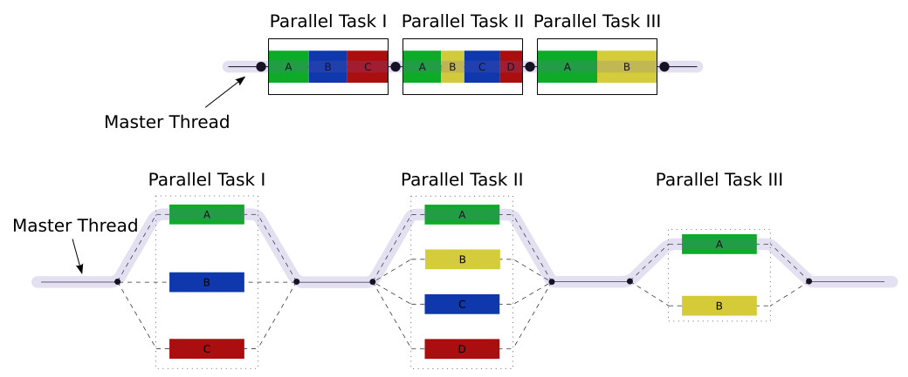
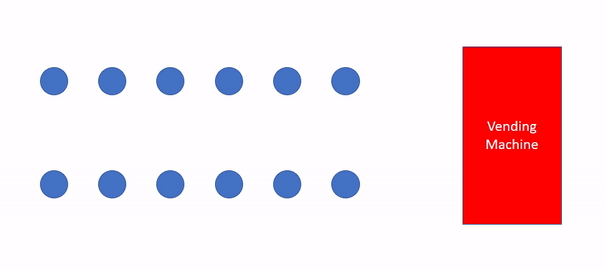
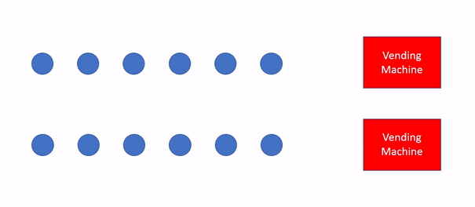
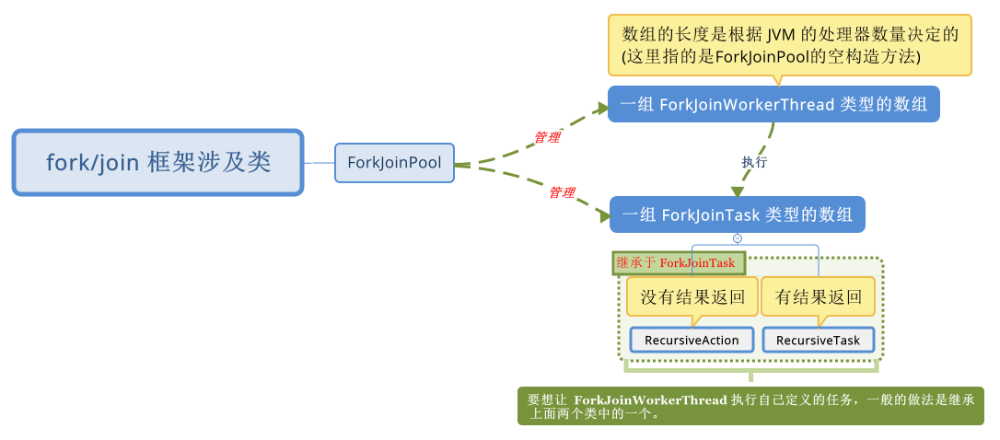

# fork/join 框架

> Fork/Join 是 JDK7 提供的一个用于并行执行任务的框架，是一个把大任务分割成若干个小人物，最终汇总每个小任务结果后的带大任务结果的框架。 -- 引自《Java 并发编程的艺术》

-   [1. Fork-Join 模型介绍](#fj-1)
-   [2. 并发与并行的区别](#fj-2)
-   [3. fork/join 框架如何工作？](#fj-3)
-   [4. fork/join 源码解析](#fj-4)
    -   [4.1 ForkJoinPool](#fj-4-1)
    -   [4.2 ForkJoinTask](#fj-4-2)
-   [5. fork/join 框架的实践](#fj-5)

## <a id="fj-1">1. Fork-Join 模型介绍</a>



上图是 Fork-Join 模型的示例图，其中程序的三个区域允许并行执行各种颜色的块。顺序执行显示在顶部，它等效的 Fork-Join 执行显示在底部。比如，Master thread 执行到 Parallel Task I 时，此时可以并行执行 A, B 和 C 这三个 task，全部执行完了之后再将三个执行结果合并到 Master Thread。

伪代码表示为：

```java
if (problemSize < threshold)

    solve problem directly

else {

    break problem into subproblems

    recursively solve each problem

    combine the results
}
```

## <a id="fj-2">2. 并发与并行的区别</a>

在介绍 fork/join 框架之前，我们先来了解一下并行和并发之间的区别。

-   并发，线程在同一个内核上执行。这意味着任务实际上以交叉方式执行，共享处理核心的处理时间。

    

    <center><strong>Concurrent: 2 queues, 1 vending machine</strong></center>

-   并行，每个线程在单独的处理核心中执行。因此，任务实际上是以真正并行的方式执行的。

    

    <center><strong>Concurrent: 2 queues, 2 vending machine</strong></center>

## <a id="fj-3">3. fork/join 框架如何工作？</a>

fork/join 框架旨在 **加速** 任务的执行，这些任务可以被划分为其他更小的子任务，并行执行它们，然后将它们的结果组合起来得到一个单独的子任务。

由于这个原因，子任务必须相互独立，操作必须是无状态的，因此这个框架不是所有问题的最佳解决方案。

fork/join 应用了 **分治原则**，通过递归的方式将任务划分为更小的子任务，直到达到给定的阈值(这是 fork 部分)。

然后，子任务被独立处理，如果它们返回一个结果，所有的结果将被递归地组合成一个结果(这是 join 部分)。


为了并行的执行这些子任务，fork/join 框架使用一个线程池，线程池中的线程数量等于与Java虚拟机(JVM)默认情况下可用的处理器数量相等(这里指的是 ForkJoinPool 的默认构造方法)。

每个线程都有它自己的双端队列(deque)，它们用自己的队列储存要被执行的子任务们。

deque 是一种队列，它支持从前(头)或后(尾)添加或删除元素。

deque 有两个特点：

1.  一个线程一次只能执行一个任务(被执行的任务位于队列的头结点)

1.  deque 实现了工作窃取(working-stealing)算法，来平衡线程的工作负荷。

工作窃取算法是指某个线程从其他队列里窃取任务来执行。为什么会发生这种情况？假设这里有 2 个线程 A 和 B，线程 A 先完成了队列里面的任务，而此时 线程 B 还正在处理任务中，出于增加吞吐量的目的，线程 A 会窃取 线程 B 中的队列里的任务。

通常情况下，为了减少窃取任务线程和被窃取任务线程之间的竞争，被窃取任务线程永远从双端队列的 **头部** 获取任务执行，而窃取任务的线程永远从双端队列的 **尾部** 窃取任务执行。

## <a id="fj-4">4. fork/join 源码解析</a>

fork/join 框架有两个重要的类：**ForkJoinPool** 和 **ForkJoinTask**。这两个类都在 `java.util.concurrent` 包下。



### <a id="fj-4">4.1 ForkJoinPool</a>

ForkJoinPool 的继承关系如下：


ForkJoinPool 实现了 `ExecutorService` 这个接口，主要是为了更好的管理并发线程。任务分割出的子任务会添加到当前工作线程所维护的双端队列中，进入队列的头部。当一个工作线程的队列里没有任务时，它会随机从其他线程的队列的尾部获取一个任务，也就是窃取算法的实现。

**ForkJoinPool 提供的构造方法：**
```java
/**
 * 空构造方法是推荐的方法。因为 Runtime.getRuntime().availableProcessors() 返回 Java 虚拟机可用的处理器数量。用这个数量作为并行等级。
 */
public ForkJoinPool(){
    this(Runtime.getRuntime().availableProcessors(),
            defaultForkJoinWorkerThreadFactory, null, false);
}

// 下面两种构造方法是可以自定义并行等级
public ForkJoinPool(int parallelism)

public ForkJoinPool(int parallelism,
                    ForkJoinWorkerThreadFactory factory,
                    Thread.UncaughtExceptionHandler handler,
                    boolean asyncMode)
```

### <a id="fj-4-2">4.2 ForkJoinTask</a>


就像 ExecutorService 能够执行实现了 Runnable 接口或者 Callable 接口 的实例一样，ForkJoinPool 调用的 ForkJoinTask 类型的任务，要想使用 ForkJoinPool 来管理任务，你必须实现 ForkJoinTask 的两个子类之一：

1. RecursiveAction，表示任务不产生返回值，就像 Runnable 一样。

1. RecursiveTask，表示任务产生返回值，就像 Callable 一样。

ForkJoinTask 有两个重要的方法：

1.  **fork()**
    ```java
    public final ForkJoinTask<V> fork() {
        ((ForkJoinWorkerThread) Thread.currentThread())
            .pushTask(this);
        return this;
    }
    ```

    **pushTask(ForkJoinTask<?>)**
    pushTask 这个方法，是将当前任务存放到 ForkJoinTask 数组队列里，然后再调用 signalWork() 唤醒或者创建一个工作线程来执行任务。
    ```java
    final void pushTask(ForkJoinTask<?> t) {
        ForkJoinTask<?>[] q; int s, m;
        // 每个线程都对应一个 ForkJoinTask[]
        if ((q = queue) != null) {    // ignore if queue removed
            long u = (((s = queueTop) & (m = q.length - 1)) << ASHIFT) + ABASE;
            UNSAFE.putOrderedObject(q, u, t);
            queueTop = s + 1;         // or use putOrderedInt
            if ((s -= queueBase) <= 2)
                pool.signalWork();
            else if (s == m)
                growQueue();
        }
    }
    ```

2.  **join()**

    join() 方法，阻塞当前线程并等待获取结果。
    ```java
    public final V join() {
        if (doJoin() != NORMAL)
            return reportResult();
        else
            return getRawResult();
    }
    ```

    **doJoin()**
    ```java
    private int doJoin() {
        Thread t; ForkJoinWorkerThread w; int s; boolean completed;
        if ((t = Thread.currentThread()) instanceof ForkJoinWorkerThread) {
            if ((s = status) < 0)
                return s;
            if ((w = (ForkJoinWorkerThread)t).unpushTask(this)) {
                try {
                    completed = exec();
                } catch (Throwable rex) {
                    return setExceptionalCompletion(rex);
                }
                if (completed)
                    return setCompletion(NORMAL);
            }
            return w.joinTask(this);
        }
        else
            return externalAwaitDone();
    }
    ```

    doJoin() 这个方法能够返回 4 中状态值：

    1.  -1(NORMAL)，代表任务状态已经完成，直接返回任务结果。
    1.  -2(CANCELLED)，代表任务被取消，直接抛出 CancellationException。
    1.  -3(EXCEPTIONAL)，代表任务执行过程中有异常，直接抛出相应的异常。
    1.  1(SIGNAL)，表明当前任务对应的 ForkJoinWorkerThread 还未初始化。在调用 ForkJoinTask.get() 方法的时候会先检查当前线程的状态是否为 SIGNAL,
        ```java
        public final V get() throws InterruptedException, ExecutionException {
            // 检查当前线程是否已经被初始化成 ForkJoinWorkerThread 对象
            int s = (Thread.currentThread() instanceof ForkJoinWorkerThread) ?
                doJoin() : externalInterruptibleAwaitDone(0L);
            Throwable ex;
            if (s == CANCELLED)
                throw new CancellationException();
            if (s == EXCEPTIONAL && (ex = getThrowableException()) != null)
                throw new ExecutionException(ex);
            return getRawResult();
        }                       
        ```

上面在解释 SIGNAL 状态的含义的时候，提到了 ForkJoinWorkerThread 初始化的时机。那么， ForkJoinWorkerThread 到底是什么时候初始化的？

ForkJoinPool 的 addWorker() 内部进行了初始化。

```java
private void addWorker() {
    Throwable ex = null;
    ForkJoinWorkerThread t = null;
    try {
        // 初始化 ForkJoinWorkerThread 对象
        t = factory.newThread(this);
    } catch (Throwable e) {
        ex = e;
    }
    if (t == null) {  // null or exceptional factory return
        long c;       // adjust counts
        do {} while (!UNSAFE.compareAndSwapLong
                        (this, ctlOffset, c = ctl,
                        (((c - AC_UNIT) & AC_MASK) |
                        ((c - TC_UNIT) & TC_MASK) |
                        (c & ~(AC_MASK|TC_MASK)))));
        // Propagate exception if originating from an external caller
        if (!tryTerminate(false) && ex != null &&
            !(Thread.currentThread() instanceof ForkJoinWorkerThread))
            UNSAFE.throwException(ex);
    }
    else
        t.start();
}
```

## <a id="fj-5">5. fork/join 框架的实践</a>

> 代码自《Java 并发编程的艺术》

跟着代码走一遍，大概的流程相信就能熟悉了。

```java
public class CountTask extends RecursiveTask<Integer> {
	
	private static final int THREADHOLD = 2;
	
	private int start;
	private int end;

	public CountTask(int start, int end) {
		this.start = start;
		this.end = end;
	}

	@Override
	protected Integer compute() {
		int sum = 0;
		
		boolean canCompute = (end - start) <= THREADHOLD;
		if(canCompute) {
			for(int i = start; i<=end; i++) {
				sum += i;
			}
		} else {
			int middle = (start + end) / 2;
			CountTask leftTask = new CountTask(start, middle);
			CountTask rightTask = new CountTask(middle + 1, end);
			
			leftTask.fork();
			rightTask.fork();
			
			int leftResult = leftTask.join();
			int rightResult = rightTask.join();
			sum = leftResult + rightResult;
		}
		return sum;
	}

	public static void main(String[] args) {
		ForkJoinPool forkJoinPool = new ForkJoinPool();
		
		CountTask task = new CountTask(1,4);
		Future<Integer> result = forkJoinPool.submit(task);
		try {
			System.out.println(result.get());
		} catch (InterruptedException | ExecutionException e) {
			e.printStackTrace();
		}
	}
}
```

## 参考

-   [Fork-Join Model](https://en.wikipedia.org/wiki/Fork-join_model)
-   [Introduction to the Fork/Join Framework](https://www.pluralsight.com/guides/introduction-to-the-fork-join-framework)

##  [BACK](../../mds/summary.md)