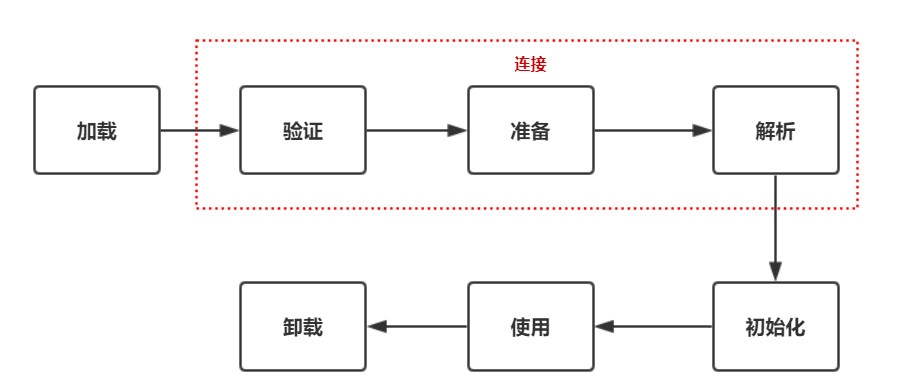

#   用 Class.forName 与用 ClassLoad 加载类之间有什么区别？

> 时间：2018年10月11日  
> JDK 版本：1.8

-   [1. 源码](#source)
    1.  [Class.forName()](#source-1)
    1.  [ClassLoad](#source-2)
-   [2. 实例对比](#example)

---

## <a id="source">1. 源码分析</a>

在分析两者之前，先来看看 java 类加载的过程。



1.  加载：JVM 将 class 字节码文件加载到内存中，并将这些静态数据转换成方法区的数据，在运行时数据区堆中生成一个表表这个类的 java.lang.Class 对象，作为方法区类数据的访问入口。
1.  连接：执行下面的校验、准备和解析步骤，其中解析步骤是可选的。
    1.  验证：检查加载的 class 文件的正确性和安全性。
    1.  准备：为类变量分配存储空间并设置类变量初始值，类变量随类型信息存放在方法区中,生命周期很长，使用不当和容易造成内存泄漏。
    1.  解析：JVM 将常量池内的符号引用转换为直接引用
1.  初始化：执行类变量赋值和静态代码块
1.  使用
1.  卸载

### <a id="source-1">Class.forName()</a>

forName(String) 方法：

```java
@CallerSensitive
public static Class<?> forName(String className)
            throws ClassNotFoundException {
    Class<?> caller = Reflection.getCallerClass();
    return forName0(className, true, ClassLoader.getClassLoader(caller), caller);
}
```

内部调用了 forName0

```java
private static native Class<?> forName0(String name, boolean initialize,
                                        ClassLoader loader,
                                        Class<?> caller)throws ClassNotFoundException;
```

forName0 是一个本地方法，第二个参数是 `boolean initialize`，这里传递的是 true，所以 forName(String) 这个方法在加载类的时候会初始化类。

### <a id="source-2">ClassLoad</a>

看看 ClassLoad.loadClass(String) 这个方法。

```java
public Class<?> loadClass(String name) throws ClassNotFoundException {
    return loadClass(name, false);
}
```

内部调用 loadClass(String, boolean)

```java
/**
 * @param name，被加载的类的全限定名称
 * @param resolve，是否将类进行解析
 */
protected Class<?> loadClass(String name, boolean resolve)
        throws ClassNotFoundException
    {
    synchronized (getClassLoadingLock(name)) {
        // First, check if the class has already been loaded
        Class<?> c = findLoadedClass(name);
        if (c == null) {
            long t0 = System.nanoTime();
            try {
                if (parent != null) {
                    c = parent.loadClass(name, false);
                } else {
                    c = findBootstrapClassOrNull(name);
                }
            } catch (ClassNotFoundException e) {
                // ClassNotFoundException thrown if class not found
                // from the non-null parent class loader
            }

            if (c == null) {
                // If still not found, then invoke findClass in order
                // to find the class.
                long t1 = System.nanoTime();
                c = findClass(name);

                // this is the defining class loader; record the stats
                sun.misc.PerfCounter.getParentDelegationTime().addTime(t1 - t0);
                sun.misc.PerfCounter.getFindClassTime().addElapsedTimeFrom(t1);
                sun.misc.PerfCounter.getFindClasses().increment();
            }
        }
        if (resolve) {
            resolveClass(c);
        }
        return c;
    }
}
```

看了源码，我们可以知道 forName 在加载类的时候会将其初始化，而 loadClass 是不会把类初始化。

## <a id="example">2. 实例对比</a>

为了讲述例子，下面将通过两种不同的方式来将 `SelfClass` 类加载进来。

```java
package com.learnclass;

public class SelfClass {

    static{
        System.out.println("SelfClass has been created!");
    }

    public void say() {
        System.out.println("hello, this is self class.");
    }
}
```

### 2.1 Class.forName 加载类

forName(String) 得到的 Class 是已经初始化过的。

可以看看下面的测试用例：

```java
package com.learnclass;

import org.junit.Test;

import java.lang.reflect.InvocationTargetException;
import java.lang.reflect.Method;

import static org.junit.Assert.assertEquals;
import static org.junit.Assert.assertNotNull;

public class ClassTest {

    @Test
    public void forNameTest() throws ClassNotFoundException, NoSuchMethodException, InvocationTargetException, IllegalAccessException, InstantiationException {
        Class selfClass = Class.forName("com.learnclass.SelfClass");
        assertEquals("SelfClass", selfClass.getSimpleName());
    }
}
```

输出结果：

>   SelfClass has been created!

为了做个对比，添加了下面的测试用例，看看正常的初始化 `SelfClass`。

```java
@Test
public void normalInitTest() {
    SelfClass instance = new SelfClass();
}
```

输出结果：

>   SelfClass has been created!

可以看出，两者的结果是一样的。

### 2.2 ClassLoad 加载类

```java
@Test
public void classloadTest() throws ClassNotFoundException, IllegalAccessException, InstantiationException {
    ClassLoader classLoader = ClassLoader.getSystemClassLoader();
    Class selfClass = classLoader.loadClass("com.learnclass.SelfClass");
    assertEquals("SelfClass", selfClass.getSimpleName());

    SelfClass instance = (SelfClass) selfClass.newInstance();
    assertNotNull(instance);
}
```

没有任何输出。

##  [BACK](../../mds/summary.md)